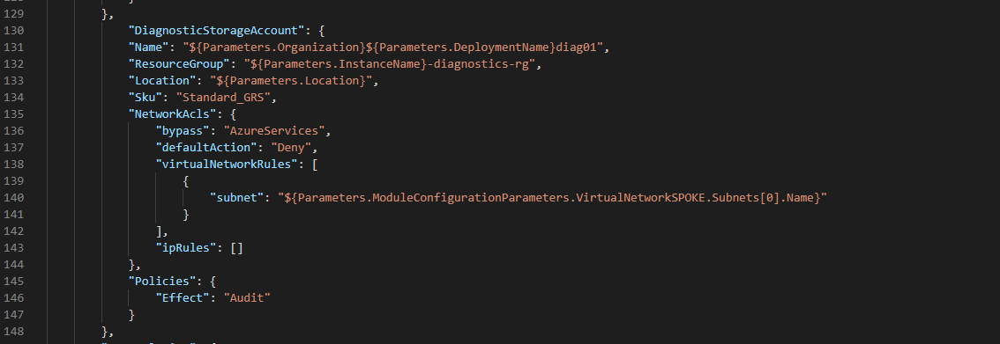

## Environment Overview

Environments are the heart of the VDC toolkit. Each environment is a set of parameter and orchestration files that deploy [modules](../Modules).

The modules consist of full deployments for different Azure resources. Ex. Virtual Machines, Virtual Networks, Key Vault etc. 
- Modules can have RBAC policies 
- Azure policies 
- Configuration scripts
- Tests to ensure the module is working as expected

Think of the VDC toolkit as a nested ARM template deployment. 
You can specify any module you would like to deploy in the Orchestration.json file under each environemnt.
Then add parameters for the module under the parameters.json file under the specificed enviornment you are deploying. 

If you want to **disable or "not deploy"** certain resources in the orchestration file without deleting them. Please refer to [folder replication documentation](../Docs/masterOrchestration/folder_replication.md).

If you are adding additional resources to the environment orchestration file. Consider the following example.

### Storage Account example 
You wish to add an additional storage account to the [MS-VDI environment](../Environments/MS-VDI). 

For this example we would utilize the [Storage Account Module](../Modules/StorageAccounts).
This module has a `deploy.json` file which deploys the storage account ARM template.

If we look at the [deploy.json](../Modules/StorageAccounts/deploy.json) file we can see that it has several parameters needed. 
1. "storageAccountName"
    - Required
2. "location"
    - Default is the resource group location
3. "storageAccountKind"
    - Default is StorageV2
ETC. 

#### Parameters.json
You can either accept the default values OR in the parameters.json file under [MS-VDI parameter.json](../Environments/MS-VDI/parameters.json)
specify the values you wish to have for the storage account. Example below Picture 1.

*Picture 1*

#### Orchestration.json
Then in the [Orchestration.json](../Environments/MS-VDI/orchestration.json) file configure it with references to the parameters.json file. You 
can also override the parameters. 

You must specify the "ModuleDefinitionName" (Yellow arrow in Picture 2) - This must match the module folder name exactly.

The [`Deployment`](../Modules/StorageAccounts/deploy.json) section will be where you reference the parameters for the *deploy.json* file in the modules section 
- (2nd Red arrow in Picture 2)

The [`Policies`](../Modules/StorageAccounts/Policy) section is where you would set an Azure Policy for storage accounts.
- (1st red arrow in Picture 2)  

If [`RBAC`](../Modules/StorageAccounts/RBAC) roles needed to be added you would add this section as well.

