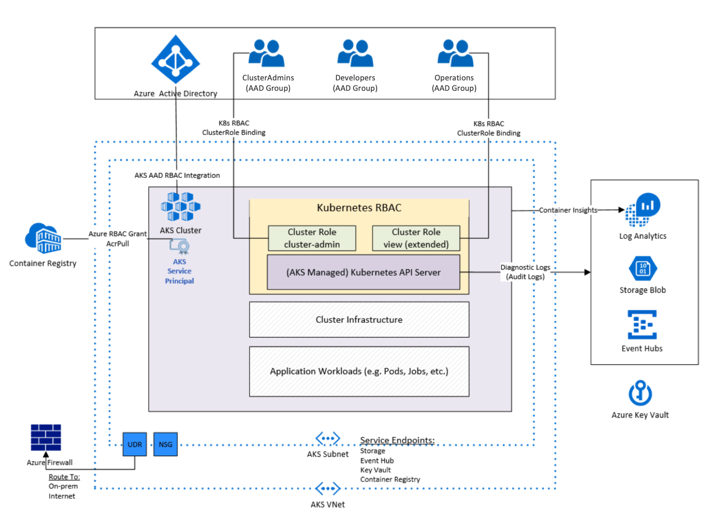

= Archetype: Azure Kubernetes Services (AKS) architecture
:toc:
:toc-placement: auto
:toclevels: 3

This archetype is based on the experience of Azure engineering working with customers using https://docs.microsoft.com/azure/aks/[Azure Kubernetes Services] (AKS). The archetype deploys a single AKS cluster to host linux-based containerized workloads.

== AKS Archetype description

An overview diagram of the Azure resources and identities created as part of this archetype: 



=== Deployed resources

The following resources were deployed as part of this archetype:   

1. *Azure Kubernetes Services (AKS) Cluster* - The AKS cluster is the core component in the archetype. Kubernetes RBAC is enabled and Cluster Role Bindings are created and mapped for a base set of personas. Those personas are described in the link:overview.adoc#deployment-assumptions[deployment assumptions] section below. Kubernetes deploys with a core set of Namespaces (kube-system, kube-public and default). Additional Namespaces should be created as services are deployed to the cluster (ex. Ingress Controller, Applications, etc).

1. *Azure Virtual Network w/ Subnet* - A virtual network and subnet are created to host the AKS Cluster Agent Nodes. This VNet is then peered with the Shared Services VNet in a hub-and-spoke model. A Network Security Group, Route Table and DDOS policy are created to support traffic shaping and offer protection against DDOS attacks. 

1. *Azure Key Vault* - A Key Vault is deployed as part of the archetype and is intended to host secrets used to manage the AKS cluster and applications hosted in the cluster. A demo CA cert is created by OpenSSL and stored in the key vault.

1. *Firewall Rule in Shared Services Archetype* - A Network Rule and Application are created in the Shared Services Azure Firewall to support the AKS archetype. The Network Rule enables SSH access, while the Application Rule enables ports 80 and 443 for fabric level management. 


1. *Services requiring additional consideration* The following resources are also deployed as part of the AKS archetype and require additional considerations. They are covered in more details in the link:overview.adoc#deployment-assumptions[deployment assumptions] section below: 
   - *Azure Container Registry*
   - *Audit Logging* 
   - *AAD Roles*
   - *Kubernetes personas* 

=== Deployment assumptions

This archetype is based on common patterns identified while working with customers deploying AKS workloads in their production environments. It may need to be changed to reflect your organization's individual requirements. 

Please review these assumptions and determine the appropriate course of action while planning your production AKS implementation. 

1. *Container Registry* - An https://docs.microsoft.com/azure/container-registry/container-registry-intro[Azure Container Registry] (ACR) is created as part of this archetype and deployed to the `{org}-{deployment-name}-acr-rg` resource group. 
   - Image pull RBAC rights to the ACR instance have been granted to the cluster service principal. A reference to the AKS documentation can be found https://docs.microsoft.com/azure/container-registry/container-registry-auth-aks[here]. 
   - For Premium ACR deployments, service endpoints are also enabled. +
+
Organizations may have their own container registry for managing container images. If so, the ACR can be safely deleted. If deploying individual modules, link:overview.adoc#step-4-deploy-azure-container-registry[Step 4] can be skipped with no impact to the remaining deployment. 

1. *Audit Logging* - https://docs.microsoft.com/azure/azure-monitor/insights/container-insights-overview[Azure Container Insights] and https://docs.microsoft.com/azure/aks/view-master-logs[Kubernetes master node logging] are enabled by default for this archetype. Collected logs are sent to three different resource types (Azure Log Analytics, Azure Storage, and Azure Event Hub), all created in the `{org}-{deployment-name}-diagnostics-rg` resource group. The other modules in this archetype expect Log Analytics to be deployed, however you may have different requirements for diagnostics. If so, you will need to make modifications to the archetype accordingly.

1. *AAD Roles* - The toolkit encourages the separation of responsibilities using Azure Active Directory role-based access control (RBAC) to determine which users and teams can create and manage specific resources. A full description of these roles and their permissions can be found link:../../understand/roles.md[here]. The link:overview.adoc#step-by-step-archetype-deployment[step-by-step archetype deployment] assumes that these user roles have been created and deployments are being performed by accounts using these permissions.


1. *Kubernetes personas* - This deployment integrates Kubernetes RBAC with Azure Active Directory and creates a sample set of personas for managing AKS cluster resources. 
   - A description of Kubernetes RBAC authorization can be found https://kubernetes.io/docs/reference/access-authn-authz/rbac/[here].
   - The scripts that implement the role bindings for the sample personas can be found link:../../../scripts/aks/create-cluster-rbac-role-bindings.sh[here]. +
+
The table below provides a description of the sample personas and role bindings. You should evaluate your specific requirements and make appropriate changes:

[options="header",cols="a,,"]
|===
| Persona | Kubernetes RBAC | Azure Resource RBAC

| *Cluster Admin*
| cluster-admin built-in cluster role
| Reader access to AKS cluster resource groups

| *Operations (NOC)*
| view built-in cluster role extended for resource listings
| Reader access to AKS cluster resource groups

| *Developer*
| edit built-in cluster role bound to namespace
| Reader access to AKS cluster resource groups
|===

== Create your archetype configuration file

The toolkit provides an example configuration file for the AKS environment. You will need to create a new version of this file before running your deployment.

1. Navigate to the toolkit's link:../../../archetypes/aks[archetypes/aks] folder.
1. Make a copy of the `archetypes.test.json` and name the copy `archetypes.json`.
1. Edit `archetypes.json` providing the subscription, organization, networking, and other configuration information that you want to use for your deployment. You will need to use some of the same values when creating the configuration for the shared services and on-premises environments.

If your copy of the toolkit is associated with the git repository, the link:../../../.gitignore[.gitignore] file is set to prevent your deployment `archetypes.json` file from being pushed to your code repository.

=== Setting archetype parameters

Modifications to these `archetypes.json` parameters are required in order to successfully deploy the archetype. The following table describes the minimum modifications required to deploy under default conditions. Additional modifications can be made, but are not covered in this document. 

[options="header",cols="a,,"]
|===
| Parameter | Constraint | Description

| `${general.organization-name}`
| Unique per subscription
| Used to construct resource names for resources deployed in this archetype. 

| `${general.tenant-id}`
| Globally unique
| Tenant ID for Azure Active Directory (AAD) tenant managing the subscription where the archetype is being deployed. 

| `${general.deployment-user-id}`
| Unique to AAD tenant
| AAD user ID for user deploying the archetype. 

| `${general.vdc-storage-account-name}`
| Regionally unique
| Storage Account for configuration files and parameters used during deployment.

| `${general.vdc-storage-account-rg}`
| Unique per subscription
| Resource Group for the previously defined Storage Account.

| `${general.on-premises}`
|
| Parameters must match the deployment parameters for the on-premises resources.

| `${general.shared-services}`
|
| Parameters must match the deployment parameters for the shared services archetype.

| `${general.workload.deployment-name}`
|
| Name assigned to the deployment of this archetype (for reference and troubleshooting).

| `${general.workload.subscription-id}`
| Globally unique
| Subscription ID where the archetype will be deployed.

| `${general.workload.region}`
|
| Azure Region to deploy the archetype.

| `${general.workload.log-analytics.region}`
|
| Azure Region to deploy Azure Log Analytics (verify supported regions before modifying).

| `${general.workload.kubernetes.service-principal-client-id}`
| Unique to AAD tenant
| ID of the Service Principal used to represent the identity of the AKS cluster. This SPN is used by the cluster to provision resources through ARM. Steps on creating this SPN can be found https://docs.microsoft.com/azure/aks/kubernetes-service-principal#manually-create-a-service-principal[here].

| `${general.workload.kubernetes.service-principal-client-secret}`
|
| Secret for the previously created AAD service principal.

| `${general.workload.kubernetes.rbac-server-appid}`
| Unique to AAD tenant
| ID for server application created for integration with Azure AD. A reference for creating this identity can be found https://docs.microsoft.com/azure/aks/aad-integration#create-server-application[here]. 

| `${general.workload.kubernetes.rbac-server-secret}`
|
| Secret for the previously created AAD server application.

| `${general.workload.kubernetes.rbac-client-appid}`
| Unique to AAD tenant
| ID for client application created for integration with Azure AD. A reference for creating this identity can be found https://docs.microsoft.com/azure/aks/aad-integration#create-client-application[here]. 

| `${general.workload.kubernetes.rbac-tenant}`
| Globally unique
| AAD Tenant where users and groups are stored that are allowed to interact with the AKS cluster through kubernetes RBAC integration. A reference can be found https://docs.microsoft.com/azure/aks/aad-integration[here]. 

| `${general.workload.kubernetes.cluster-admin-group-id}`
| Unique to RBAC AAD tenant
| Cluster Admin persona AAD group in the RBAC tenant (used to manage group membership). A description of each persona can be found in the link:overview.adoc#deployment-assumptions[deployment assumptions] section of this document. 

| `${general.workload.kubernetes.noc-user-group-id}`
| Unique to RBAC AAD Tenant
| NOC persona AAD group in the RBAC Tenant (used to manage group membership). A description of each persona can be found in the link:overview.adoc#deployment-assumptions[deployment assumptions] section of this document. 

| `${general.workload.kubernetes.dev-user-group-id}`
| Unique to RBAC AAD Tenant
| Developer persona AAD group in the RBAC Tenant (used to manage group membership). A description of each persona can be found in the link:overview.adoc#deployment-assumptions[deployment assumptions] section of this document. 
|===

== Run the deployment

=== Single step archetype deployment - Required permissions: Subscription Owner

This section performs an end-to-end deployment of the AKS archetype. It assumes the account performing the deployment has *Owner* permissions to the subscription where the archetype is being deployed. 

Start the workload deployment by running the following commands based on the platform you are deploying from:

.Docker
[source,bash]
python vdc.py create workload -path archetypes/aks/archetypes.json

.Linux/OSX
[source,bash]
python3 vdc.py create workload -path archetypes/aks/archetypes.json 

.Windows
[source,cmd]
py vdc.py create workload -path archetypes/aks/archetypes.json 

This deployment creates the following resource groups and AKS archetype resources.

[options="header",cols="a,"]
|===
| Resource Group | Description

| `{org}-{deployment-name}-diagnostics-rg` 
| Monitoring resources (Azure Log Analytics, Azure Event Hub, Azure Storage)

| `{org}-{deployment-name}-kv-rg` 
| Azure key vault for secret management.

| `{org}-{deployment-name}-net-rg` 
| Networking resource (Azure Virtual Network, Network Security Groups, Route Tables, DDOS policy)

| `{org}-{deployment-name}-arc-rg` 
| Azure container registry for image management. 

| `{org}-{deployment-name}-rg` 
| Azure AKS resource type for the managed kubernetes cluster.

| `MC_{org}-{deployment-name}-rg_{org}-{deployment-name}-k8s_{region}`
| Azure resources backing the AKS cluster (Virtual Machines, Managed Disks, Availability Set, etc).
|===

This completes the AKS archetype single step deployment.

Please proceed to the link:overview.adoc#aks-cluster-topology-view[AKS Cluster Topology Diagram] for an overview of the AKS resources deployed and login instructions. 

*DO NOT* proceed to the next deployment step if you have performed the _Single Step Archetype Deployment_. 

=== Step-by-step archetype deployment - Required permissions: Based on admin role

This section assumes the organization has separated administrative responsibilities into a core set of roles using role-based access control (RBAC). Please review the link:../../understand/roles.md[roles and permissions] section to understand those roles and their associated permissions. 

If your account has subscription Owner permissions you can deploy all modules with your account. 

==== Step 1: Deploy operations and monitoring resources - Required role: SecOps

This step pre-provisions target resources that will be used for collection and analysis of Azure Kubernetes Service (AKS) operational and security data. 

Later in the workload deployment process, kubernetes master node logging is enabled in the Azure Kubernetes Service (AKS) environment and logs are passed to these target resources for collection and analysis. More details on master node logging in AKS can be found https://docs.microsoft.com/azure/aks/view-master-logs[here]. 

Four modules are deployed in this step:

- The `diagnostic-storage-account` module enables diagnostic logging and creates the Azure storage account used for collecting those logs. 
- The `la` module creates the log analytics workspace and multiple oms solutions to provide additional insights on logs collected. 
- The `security-center` module enables the Azure security center standard pricing tier and enables it on virtual machines, storage accounts and log analytics.
- The `event-hub` module creates an Azure Event Hub namespace and default Event Hub, along with setting up the default authorization rules. 

Start the module deployments by running the following commands based on the platform you are deploying from:

.Docker
[source,bash]
python vdc.py create workload -path archetypes/aks/archetypes.json -m diagnostic-storage-account
python vdc.py create workload -path archetypes/aks/archetypes.json -m la
python vdc.py create workload -path archetypes/aks/archetypes.json -m security-center
python vdc.py create workload -path archetypes/aks/archetypes.json -m event-hub

.Linux/OSX
[source,bash]
python3 vdc.py create workload -path archetypes/aks/archetypes.json -m diagnostic-storage-account
python3 vdc.py create workload -path archetypes/aks/archetypes.json -m la
python3 vdc.py create workload -path archetypes/aks/archetypes.json -m security-center
python3 vdc.py create workload -path archetypes/aks/archetypes.json -m event-hub

.Windows
[source,cmd]
py vdc.py create workload -path archetypes/aks/archetypes.json -m diagnostic-storage-account
py vdc.py create workload -path archetypes/aks/archetypes.json -m la
py vdc.py create workload -path archetypes/aks/archetypes.json -m security-center
py vdc.py create workload -path archetypes/aks/archetypes.json -m event-hub

These deployments creates the `{org}-{deployment-name}-diagnostics-rg` resource group that hosts the resources described in the following table.

[options="header",cols="a,,"]
|===
| Resource | Type | Description

| `{org}{deployment-name}diag{uniquestring}` (dashes removed)
| Storage Account
| Storage Account for collecting AKS workload logs.

| `{org}-{deployment-name}-la`
| Log Analytics workspace
| Log Analytics instance for monitoring the AKS cluster workload.

| `OMS Solutions`
| Solution
| AntiMalware, AzureAutomations, ChangeTracking, KeyVaultAnalytics, Security, SecurityCenterFree, SQLAssessment and Updates. 

| `{org}eventhubnamespace`
| Event Hub Namespace
| Event Hub Namespace with `{org}-diagnostics-eventhub` Event Hub for collecting AKS workload logs. 
|===

==== Step 2: Deploy the virtual network - Required role: NetOps 

This step deploys three modules in the following order:

- The `nsg` module creates the network security groups (NSGs) and application security groups (ASGs) that secure the workload's virtual network. By default, the example workload net deployment creates a set of NSGs and ASGs compatible with an n-tier application, consisting of web, business, and data tiers. 
- The `workload-net` module creates the workload's virtual network, along with setting up the default subnet and User Defined Routes (UDRs) used to route traffic to the shared services network. This deployment also creates the VNet peering that connects the shared services and workload networks.
- The `enable-service-endpoint-on-diagnostic-storage-account` module enables service endpoints for the diagnostic storage account for enhanced security. on the workload virtual network hostinthe workload's virtual network, along with setting up the default subnet and User Defined Routes (UDRs) used to route traffic to the shared services network. This deployment also creates the VNet peering that connects the shared services and workload networks.

Start the module deployments by running the following commands based on the platform you are deploying from:

.Docker
[source,bash]
python vdc.py create workload -path archetypes/aks/archetypes.json -m nsg
python vdc.py create workload -path archetypes/aks/archetypes.json -m workload-net
python vdc.py create workload -path archetypes/aks/archetypes.json -m enable-service-endpoint-on-diagnostic-storage-account

.Linux/OSX
[source,bash]
python3 vdc.py create workload -path archetypes/aks/archetypes.json -m nsg
python3 vdc.py create workload -path archetypes/aks/archetypes.json -m workload-net
python3 vdc.py create workload -path archetypes/aks/archetypes.json -m enable-service-endpoint-on-diagnostic-storage-account

.Windows
[source,cmd]
py vdc.py create workload -path archetypes/aks/archetypes.json -m nsg
py vdc.py create workload -path archetypes/aks/archetypes.json -m workload-net
py vdc.py create workload -path archetypes/aks/archetypes.json -m enable-service-endpoint-on-diagnostic-storage-account

These deployments creates the `{org}-{deployment-name}-net-rg` resource group that hosts the resources described in the following table.

[options="header",cols="a,,a"]
|===
| Resource | Type | Description

| `{org}-{deployment-name}-vnet`
| Virtual network
| The primary workload's virtual network with a single `default` subnet. Service Endpoints created to the default subnet for EventHub, KeyVault, Sql and Storage. 

| `{org}-{deployment-name}-{defaultsubnetname}-nsg`
| Network security group
| Network security group attached to the `default` subnet.

| `{org}-{deployment-name}-{defaultsubnetname}-udr`
| Route table
| User Defined Routes for routing traffic to and from the shared services and on-premises networks.
|===

==== Step 3: Deploy Key Vault - Required role: SecOps (and local Administrator for script prerequisites)

The next step is deploying the kv module, which creates a Key Vault resource. This step needs to occur after the Service Endpoint creation step due to the dependency on an existing Service Endpoint. 

This step deploys four modules in the following order:

- The `kv` module deploys Azure Key Vault as a Service Endpoint to the AKS virtual network.
- The `permissions-scripts-pre-reqs` module runs scripts necessary to run custom scripts.
- The `scripts-pre-reqs` module downloads resources and runs scripts necessary to run custom scripts.
- The `create-ca-cert` module creates a demo CA cert using OpenSSL and stores it in the Key Vault. Permissions to create the certificate in Key Vault are granted to the `deployment-user-id` identified in the `archetypes.json` deployment file.

Secrets defined in the `archetypes.json` as well as future encryption keys (used in Azure Disk Encryption extension) will be stored in the Key Vault and used by other resources in subsequent deployment steps.

Secrets used for the AKS deployment (ssh, secure tiller, etc) - 
- CA cert for scoped keys

These values are stored as secrets in the vault. To modify the default values for these passwords edit the link:../../../modules/kv/1.0/azureDeploy.parameters.json[Key Vault (kv) module parameters file] and update the secrets-object parameter.

Start the module deployment by running the following commands based on the platform you are deploying from:

.Docker
[source,bash]
python vdc.py create workload -path archetypes/aks/archetypes.json -m kv
python vdc.py create workload -path archetypes/aks/archetypes.json -m permissions-scripts-pre-reqs
python vdc.py create workload -path archetypes/aks/archetypes.json -m scripts-pre-reqs
python vdc.py create workload -path archetypes/aks/archetypes.json -m create-ca-cert

.Linux/OSX
[source,bash]
python3 vdc.py create workload -path archetypes/aks/archetypes.json -m kv
python3 vdc.py create workload -path archetypes/aks/archetypes.json -m permissions-scripts-pre-reqs
python3 vdc.py create workload -path archetypes/aks/archetypes.json -m scripts-pre-reqs
python3 vdc.py create workload -path archetypes/aks/archetypes.json -m create-ca-cert

.Windows
[source,cmd]
py vdc.py create workload -path archetypes/aks/archetypes.json -m kv
py vdc.py create workload -path archetypes/aks/archetypes.json -m permissions-scripts-pre-reqs
py vdc.py create workload -path archetypes/aks/archetypes.json -m scripts-pre-reqs
py vdc.py create workload -path archetypes/aks/archetypes.json -m create-ca-cert

This deployment creates the `{org}-{deployment-name}-kv-rg` resource group that hosts the resources described in the following table.

[options="header",cols="a,,"]
|===
| Resource | Type | Description

| `{org}-{deployment-name}-kv` 
| Key Vault
| Key Vault instance for the workload. One certificate deployed by default.

| `{org}-{deployment-name}-ca` 
| Certificate
| Sample certification uploaded to the Key Vault. 
|===

==== Step 4: Deploy Azure Container Registry - Required role: DevOps

The next step is deploying the `acr` module, which creates an Azure Container Registry which is a private Docker registry in Azure for storing and managing your private Docker images. Image pull RBAC rights to the ACR instance are also granted to the cluster service principal. 

Start the module deployment by running the following command based on the platform you are deploying from:

.Docker
[source,bash]
python vdc.py create workload -path archetypes/aks/archetypes.json -m acr

.Linux/OSX
[source,bash]
python3 vdc.py create workload -path archetypes/aks/archetypes.json -m acr

.Windows
[source,cmd]
py vdc.py create workload -path archetypes/aks/archetypes.json -m acr

This deployment creates the `{org}-{deployment-name}-acr-rg` resource group that hosts the resources described in the following table.

[options="header",cols="a,,"]
|===
| Resource | Type | Description

| `{org}{deployment-name}acr` 
| Azure Container Registry
| Azure Container Registry for storing and managing private Docker images.
|===

==== Step 5: Deploy AKS workload resources - Required role: Subscription Owner 

Once the monitoring, Key Vault, virtual network resources and Azure Container Registry are provisioned, your team can begin deploying the AKS workload resources. 

*Account Permissions*

While provisioning AKS, the Service Principal provided to the cluster is granted delegated access to create and manage certain Azure resources. A few examples are:

- Contributor access to the `MC_{org}-{deployment-name}-rg_{org}-{deployment-name}-k8s_{region}` Resource Group created to host the AKS resources.
- Read/join access to the virtual network where the AKS cluster is deployed. 

The Account/Service Principal used to deploy AKS requires Owner permissions at the Subscription level in order to assign access rights to the Service Principal during the deployment. 

Alternatively, the Service Principal provided to the cluster can be delegated access rights prior to the deployment. Doing so would allow the Account/Service Principal used to deploy AKS to only require Contributor permissions at the Subscription level. 

For more information on how to delegate access to the AKS Service Principal prior to deployment, please reference the Delegated Access section of the AKS Service Principal document https://docs.microsoft.com/en-us/azure/aks/kubernetes-service-principal#delegate-access-to-other-azure-resources[here]. 

*Deploying AKS*

This step deploys four modules in the following order:

- The `aks` module creates the AKS Cluster resource, enabled monitoring and creates an Azure Firewall rule to enable egress to endpoints required for AKS cluster functionality. 
- The `role-assignments-rg-scope` module creates the required RBAC grants to the AKS cluster resource group `{org}-{deployment-name}-rg`.
- The `aks-node-role-assignments` module creates the required RBAC grants to the auto-generated AKS cluster resource group.
- The `create-cluster-rbac-role-bindings` module creates the AKS cluster roles and cluster role bindings for kubernetes RBAC integration with Azure Active Directory. 

Start the module deployments by running the following commands based on the platform you are deploying from:

.Docker
[source,bash]
python vdc.py create workload -path archetypes/aks/archetypes.json -m aks
python vdc.py create workload -path archetypes/aks/archetypes.json -m role-assignments-rg-scope
python vdc.py create workload -path archetypes/aks/archetypes.json -m aks-node-role-assignments
python vdc.py create workload -path archetypes/aks/archetypes.json -m create-cluster-rbac-role-bindings

.Linux/OSX
[source,bash]
python3 vdc.py create workload -path archetypes/aks/archetypes.json -m aks
python3 vdc.py create workload -path archetypes/aks/archetypes.json -m role-assignments-rg-scope
python3 vdc.py create workload -path archetypes/aks/archetypes.json -m aks-node-role-assignments
python3 vdc.py create workload -path archetypes/aks/archetypes.json -m create-cluster-rbac-role-bindings

.Windows
[source,cmd]
py vdc.py create workload -path archetypes/aks/archetypes.json -m aks
py vdc.py create workload -path archetypes/aks/archetypes.json -m role-assignments-rg-scope
py vdc.py create workload -path archetypes/aks/archetypes.json -m aks-node-role-assignments
py vdc.py create workload -path archetypes/aks/archetypes.json -m create-cluster-rbac-role-bindings

This deployment creates the following resource groups and AKS archetype resources.

[options="header",cols="a,"]
|===
| Resource Group | Description

| `{org}-{deployment-name}-rg` 
| The Resouce Group for hosting `{org}-{deployment-name}-aks`, the Azure AKS resource type for the managed kubernetes cluster.

| `MC_{org}-{deployment-name}-rg_{org}-{deployment-name}-k8s_{region}`
| The Resource Group created to host AKS resources such as Agent Node virtual machines, disks, network interfaces and availability sets.
|===

== AKS cluster topology view

An AKS cluster topology diagram of the cluster created as part of this archetype: 


== Log into AKS Cluster

As a final step, download kubectl and log into the newly created cluster: 

```bash
# Install kubectl (if not already installed)
sudo az aks install-cli

# Set resources values
RESOURCE_GROUP={org}-{deployment-name}-rg
CLUSTER_NAME={org}-{deployment-name}-k8s

# Get the Kubernetes cluster credentials
az aks get-credentials --resource-group=$RESOURCE_GROUP --name=$CLUSTER_NAME

# You will be prompted to login to the RBAC AAD Tenant with credentials that have permissions to the AKS cluster

```