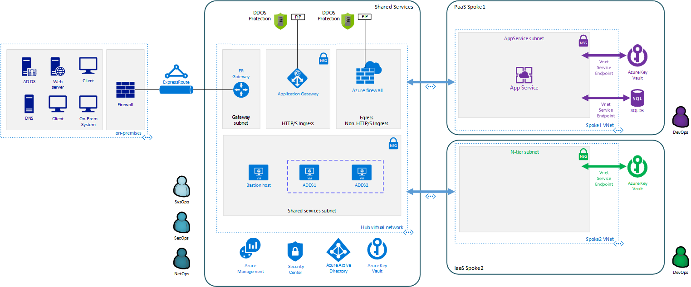

= Archetype: IaaS N-tier architecture
:toc:
:toc-placement: auto
:toclevels: 2

This archetype is based on the https://docs.microsoft.com/azure/architecture/guide/architecture-styles/n-tier[N-tier application] reference architecture using virtual machines. The archetype deploys a single virtual machine running SQL Server and two load-balanced virtual machines for each of your application tiers.

== Create your archetype configuration file

The toolkit provides an example configuration file for the shared services environment. You will need to create a new version of this file before running your deployment.

1. Navigate to the toolkit's link:../../../archetypes/ntier-iaas[archetypes/ntier-iaas] folder.
1. Make a copy of the `archetype.test.json` and name the copy `archetype.json`.
1. Edit `archetype.json` providing the subscription, organization, networking, and other configuration information that you want to use for your deployment. You will need to use some of the same values when creating the configuration for the shared services environment.

If your copy of the toolkit is associated with the git repository, the link:../../../.gitignore[.gitignore] file is set to prevent your deployment `archetype.json` file from being pushed to your code repository.

== Run the deployment

[NOTE] 
====
This deployment creates an App Gateway in Shared Services Network, since App Gateway deployment creates HTTP and HTTPS listeners, there is a *_pre-requirement_* to populate Certificates in Shared Services' Key Vault. 
Make sure that all secrets from `keyvault.secrets` found here link:../../archetypes/shared-services/parameters.adoc#shared-services-settings[archetypes/shared-services/parameters.adoc] are populated.

App Gateway deployment retrieves Certificate information from Shared Services Key Vault.

In case you need to populate Certificate information, update your Shared Services `archetypes.json` file, fill in all the secrets located in `general.shared-services.keyvault.secrets` and run Shared Services - Key Vault module deployment only.
====

All workload environments require a common set of operations, key vault, and virtual network resources before they can connect to the hub network and host workloads. The following steps will deploy these required resources.

=== Step 1: Deploy operations and monitoring resources

*Required role: SysOps*

This step provisions the operations and monitoring resources for the workload environment.

Start the `la` deployment by running the following command in the terminal or command-line interface:

.Docker
[source,bash]
python vdc.py create workload -path archetypes/ntier-iaas/archetype.json -m la

.Linux/OSX
[source,bash]
python3 vdc.py create workload -path archetypes/ntier-iaas/archetype.json -m la

.Windows
[source,cmd]
py vdc.py create workload -path archetypes/ntier-iaas/archetype.json -m la

This deployment creates the `{org}-{deployment-name}-la-rg` resource group that hosts the resources described in the following table.

[options="header",cols="a,,"]
|===
| Resource | Type | Description

| `{org}-{deployment-name}-la`
| Log Analytics
| Log Analytics instance for monitoring the workload's network.
|===

=== Step 2: Deploy Key Vault

*Required role: SecOps*

The next step is deploying the kv module, which creates a Key Vault resource and stores secrets defined in the `archetype.json` as well as creating encryption keys (used in Azure Disk Encryption extension), that other resources will use in subsequent deployment steps.

These values are stored as secrets in the vault. To modify the default values for these passwords edit the link:../../../modules/kv/1.0/azureDeploy.parameters.json[Key Vault (kv) module parameters file] and update the secrets-object parameter.

Start the `kv` deployment by running the following command in the terminal or command-line interface:

.Docker
[source,bash]
python vdc.py create workload -path archetypes/ntier-iaas/archetype.json -m kv

.Linux/OSX
[source,bash]
python3 vdc.py create workload -path archetypes/ntier-iaas/archetype.json -m kv

.Windows
[source,cmd]
py vdc.py create workload -path archetypes/ntier-iaas/archetype.json -m kv

This deployment creates the `{org}-{deployment-name}-kv-rg` resource group that hosts the resources described in the following table.

[options="header",cols="a,,"]
|===
| Resource | Type | Description

| `{org}-{deployment-name}-kv` 
| Key Vault
| Key Vault instance for the workload. One certificate deployed by default.

| `{org}{deployment-name}kvdiag` (with any dashes removed)
| Storage account
| Location of Key Vault audit logs.
|===

=== Step 3: Deploy the virtual network

*Required role: NetOps*

This step involves two resource deployments in the following order:

- The `nsg` module creates the network security groups (NSGs) and Application security groups (ASGs) that secure the workload's virtual network. By default, the example workload net deployment creates a set of NSGs and ASGs compatible with an n-tier application, consisting of web, business, and data tiers. 
- The `workload-net` module creates the workload's virtual network, along with setting up the default subnet and User Defined Routes (UDRs) used to route traffic to the shared services network. This deployment also creates the VNet peering that connects the shared services and workload networks.

Start the `nsg` deployment by running the following command in the terminal or command-line interface:

.Docker
[source,bash]
python vdc.py create workload -path archetypes/ntier-iaas/archetype.json -m nsg

.Linux/OSX
[source,bash]
python3 vdc.py create workload -path archetypes/ntier-iaas/archetype.json -m nsg

.Windows
[source,cmd]
py vdc.py create workload -path archetypes/ntier-iaas/archetype.json -m nsg

Then start the `workload-net` deployment by running the following command in the terminal or command-line interface:

.Docker
[source,bash]
python vdc.py create workload -path archetypes/ntier-iaas/archetype.json -m workload-net

.Linux/OSX
[source,bash]
python3 vdc.py create workload -path archetypes/ntier-iaas/archetype.json -m workload-net

.Windows
[source,cmd]
py vdc.py create workload -path archetypes/ntier-iaas/archetype.json -m workload-net

These deployment creates the `{org}-{deployment-name}-net-rg` resource group that hosts the resources described in the following table.

[options="header",cols="a,,a"]
|===
| Resource | Type | Description

|`{org}-{deployment-name}-business-asg`
| Application security group
| ASG for business-tier resources.

| `{org}-{deployment-name}-data-asg`
| Application security group
| ASG for data-tier resources.

| `{org}-{deployment-name}-web-asg`
| Application security group
| ASG for web-tier resources.

| `{org}-{deployment-name}-vnet`
| Virtual network
| The primary workload's virtual network with a single default subnet.

| `{org}-{deployment-name}-{defaultsubnetname}-nsg`
| Network security group
| Network security group attached to the default subnet.

| `{org}-{deployment-name}-udr`
| Route table
| User Defined Routes for routing traffic to and from the shared services network.

| `{org}{deployment-name}diag{random-characters}` (with any dashes removed)
| Storage account 
| Storage location for virtual network diagnostic data.
|===

== Deploy workload resources

Once the monitoring, Key Vault, and virtual network resources are provisioned, your team can begin deploying the actual workload resources. Performing the following tasks provisions the virtual machines and load balancers needed by Application Owners to deploy an application with a data, business, and web tier.

image:_media/workload-iaas-complete.png[Workload deployed into spoke network]

=== Deploy data tier

The `sqlserver-alwayson` module creates a pair of load-balanced SQL Server virtual machines using Cloud Witness used for the application's data layer.

A local user account will be created for these machines. The user name is defined in the `local-admin-user` parameter of the archetype configuration file. The password for this user is generated and stored in the workload key vault as part of the `kv` module deployment.

Start this deployment by running the following command in the terminal or command-line interface:

.Docker
[source,bash]
python vdc.py create workload -path archetypes/ntier-iaas/archetype.json -m sqlserver-alwayson

.Linux/OSX
[source,bash]
python3 vdc.py create workload -path archetypes/ntier-iaas/archetype.json -m sqlserver-alwayson

.Windows
[source,cmd]
py vdc.py create workload -path archetypes/ntier-iaas/archetype.json -m sqlserver-alwayson

These deployment creates the `{org}-{deployment-name}-sqlserver-alwayson-rg` resource group that hosts the resources described in the following table.

[options="header",cols="a,,a"]
|===
| Resource | Type | Description

| `sqlsvr1datadisk1{random-characters}`
| Disk
| First data disk for SQL Server virtual machine #1.

| `sqlsvr1datadisk2{random-characters}`
| Disk
| Second data disk for SQL Server virtual machine #1.

| `sqlsvr1osdisk{random-characters}`
| Disk
| OS disk for SQL Server virtual machine #1.

| `sqlsvr2datadisk1{random-characters}`
| Disk
| First data disk for SQL Server virtual machine #2.

| `sqlsvr2datadisk2{random-characters}`
| Disk
| Second data disk for SQL Server virtual machine #2.

| `sqlsvr2osdisk{random-characters}`
| Disk
| OS disk for SQL Server virtual machine #2.

| `sqlsvr-as`
| Availability set
| Availability set for virtual machines.

| `sqlsvrcw{random-characters}`
| Storage account
| Windows Server https://docs.microsoft.com/windows-server/failover-clustering/deploy-cloud-witness[Cloud Witness] storage account.

| `sqlsvrdiag{random-characters}`
| Storage account
|SQL Server virtual machine diagnostic storage account.

| `{org}-{deployment-name}-sqlsvr-lb`
| Load balancer
| Load balancer for virtual machines.

| `{org}-{deployment-name}-sqlsvr-vm1`
| Virtual machine
| SQL Server virtual machine #1.

| `{org}-{deployment-name}-sqlsvr-vm1-nic`
| Network interface
| NIC for SQL Server virtual machine #1.

| `{org}-{deployment-name}-sqlsvr-vm2`
| Virtual machine
| SQL Server virtual machine #2.

| `{org}-{deployment-name}-sqlsvr-vm2-nic`
| Network interface
| NIC for SQL Server virtual machine #2.
|===

=== Deploy web tier

The `vmapp-lb` module creates the two virtual machines and a load balancer used by the application's web-tier assets.

A local user account will be created for these machines. The user name is defined in the `local-admin-user` parameter of the archetype configuration file. The password for this user is generated and stored in the workload key vault as part of the `kv` deployment.

Note that both the web tier and business tier use the `vmapp-lb` module to deploy their resources. The toolkit provides two parameter files, one for web and one for business, in the module. These are referenced in the archetype configuration's module dependencies section as `vmapp-web-lb` and `vmapp-biz-lb`, with the corresponding module parameter file locations for each. In this step we will be calling `vmapp-web-lb`.

Start this deployment by running the following command in the terminal or command-line interface:

.Docker
[source,bash]
python vdc.py create workload -path archetypes/ntier-iaas/archetype.json -m vmapp-web-lb

.Linux/OSX
[source,bash]
python3 vdc.py create workload -path archetypes/ntier-iaas/archetype.json -m vmapp-web-lb

.Windows
[source,cmd]
py vdc.py create workload -path archetypes/ntier-iaas/archetype.json -m vmapp-web-lb

These deployment creates the `{org}-{deployment-name}-web-rg` resource group that hosts the resources described in the following table.

[options="header",cols="a,,a"]
|===
| Resource | Type | Description

|`{org}-{deployment-name}-web-app-lb`
| Load balancer
| Load balancer for Web-tier virtual machines.

| `{org}-{deployment-name}-web-app-vm1`
| Virtual machine
| Web-tier virtual machine #1.

| `{org}-{deployment-name}-web-app-vm1-nic`
| Network interface
| NIC for virtual machine #1.

| `{org}-{deployment-name}webappvm1osdisk{random-characters}` (with any dashes removed)
| Disk
| OS disk for virtual machine #1.

|`{org}-{deployment-name}-web-app-vm2`
| Virtual machine
| Web-tier virtual machine #2.

| `{org}-{deployment-name}-web-app-vm2-nic`
| Network interface
| NIC for virtual machine #2.

| `{org}-{deployment-name}webappvm2osdisk{random-characters`} (with any dashes removed)
| Disk
| OS disk for virtual machine #2.

| `web-app-as`
| Availability set
| Availability set for Web-tier virtual machines.

| `webappdiag{random-characters}`
| Storage account
| Web-tier virtual machine diagnostic storage account.
|===

=== Deploy Application Gateway in shared services virtual network

*Required role: NetOps*

To provide Internet Ingress access, the workload deployment creates an Azure Application Gateway in the shared services network. This gateway will provide access
to the web-tier load balancer from the public internet.

To deploy the application gateway, start the `app-gateway` deployment by running the following command in the terminal or command-line interface:

.Docker
[source,bash]
python vdc.py create workload -path archetypes/ntier-iaas/archetype.json -m app-gateway

.Linux/OSX
[source,bash]
python3 vdc.py create workload -path archetypes/ntier-iaas/archetype.json -m app-gateway

.Windows
[source,cmd]
py vdc.py create workload -path archetypes/ntier-iaas/archetype.json -m app-gateway

This deployment will deploy resource to the shared services subscription's `{org}-{workload-deployment-name}-net-rg` resource group.

[options="header",cols="a,,a"]
|===
| Resource | Type | Description

| `{org}-{deployment-name}-app-gw`
| Virtual network gateway
| Application gateway used to provide access to the Web tier from the internet.

| `{org}-{deployment-name}-app-gw-pip`
| Public IP address
| Publicly accessible IP address used by the application gateway.
|===

=== Deploy business tier

After deploying the application gateway, you will deploy two business tier VMs using the same `vmapp-lb` deployment module you used to deploy the application's web tier.

A local user account will be created for these machines. The user name is defined in the `local-admin-user` parameter of the archetype configuration file. The password for this user is generated and stored in the workload key vault as part of the `kv` deployment.

Start this deployment by running the following command in the terminal or command-line interface:

.Docker
[source,bash]
python vdc.py create workload -path archetypes/ntier-iaas/archetype.json -m vmapp-biz-lb

.Linux/OSX
[source,bash]
python3 vdc.py create workload -path archetypes/ntier-iaas/archetype.json -m vmapp-biz-lb

.Windows
[source,cmd]
py vdc.py create workload -path archetypes/ntier-iaas/archetype.json -m vmapp-biz-lb

These deployment creates the `{org}-{deployment-name}-biz-rg` resource group that hosts the resources described in the following table.

[options="header",cols="a,,a"]
|===
| Resource | Type | Description

| `{org}-{deployment-name}-biz-app-lb`
| Load balancer
| Load balancer for business-tier virtual machines.

| `{org}-{deployment-name}-biz-app-vm1`
| Virtual machine
| Business-tier virtual machine #1.

| `{org}-{deployment-name}-biz-app-vm1-nic`
| Network interface
| NIC for virtual machine #1.

| `{org}-{deployment-name}bizappvm1osdisk{random-characters}`` (with any dashes removed)
| Disk
| OS disk for virtual machine #1.

| `{org}-{deployment-name}-biz-app-vm2`
| Virtual machine
| Business-tier virtual machine #2.

| `{org}-{deployment-name}-biz-app-vm2-nic`
| Network interface
| NIC for virtual machine #2.

| `{org}-{deployment-name}bizappvm2osdisk{random-characters}`` (with any dashes removed)
| Disk
| OS disk for virtual machine #2.

| `biz-app-as`
| Availability set
| Availability set for business-tier virtual machines.

| `bizappdiag{random-characters}`
| Storage account
| Business-tier virtual machine diagnostic storage account.
|===

== Next steps

Review the link:parameters.adoc[parameter settings] for this archetype.
