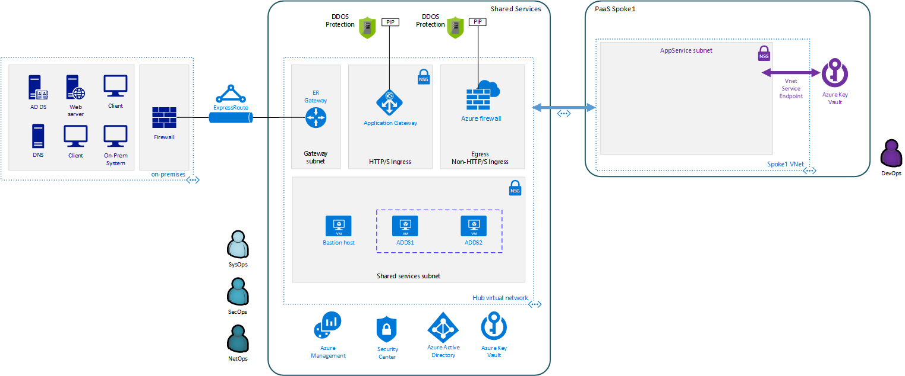
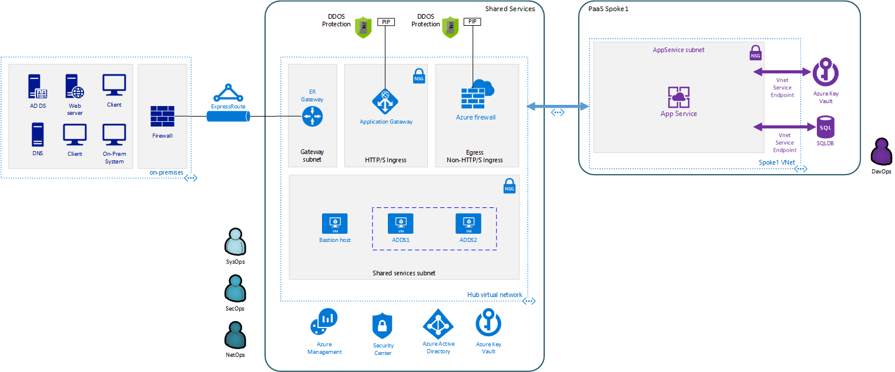

= Archetype: App Service Environment + SQL Database
:toc:
:toc-placement: auto
:toclevels: 2

This archetype uses managed platform services. It provisions an Azure SQL Database and securely connects it to the workload's virtual network using a https://docs.microsoft.com/azure/virtual-network/virtual-network-service-endpoints-overview[Virtual Network service endpoint] for the data tier. The web and business tiers are provisioned using an https://docs.microsoft.com/azure/app-service/environment/intro[Azure App Service Environment] and securely connected to the workload virtual network.

== Create your archetype configuration file

The toolkit provides an example configuration file for the shared services environment. You will need to create a new version of this file before running your deployment.

1. Navigate to the toolkit's link:../../../archetypes/paas[archetypes/paas] folder.
1. Make a copy of the `archetype.test.json` and name the copy `archetype.json`.
1. Edit `archetype.json` providing the subscription, organization, networking, and other configuration information that you want to use for your deployment. You will need to use some of the same values when creating the configuration for the shared services environment.

If your copy of the toolkit is associated with the git repository, the link:../../../.gitignore[.gitignore] file is set to prevent your deployment `archetype.json` file from being pushed to your code repository.

== Deploy workload infrastructure

All workload environments require a common set of operations, monitoring, key vault, and virtual network resources before they can connect to the shared services network and start hosting workloads. The following steps will deploy these required resources.

== Step 1: Deploy diagnostic storage accounts

*Required role: SysOps*

The first required resource deployment is `diagnostic-storage-account` module, which deploys the Azure Storage accounts where diagnostic and metrics information will be stored.

Start the `diagnostic-storage-account` deployment by running the following command in the terminal or command-line interface:

.Docker
[source,bash]
python vdc.py create shared-services -path archetypes/shared-services/archetype.json -m diagnostic-storage-account

.Linux/OSX
[source,bash]
python3 vdc.py create shared-services -path archetypes/shared-services/archetype.json -m diagnostic-storage-account

.Windows
[source,cmd]
py vdc.py create shared-services -path archetypes/shared-services/archetype.json -m diagnostic-storage-account

This deployment creates the `{org}-{deployment-name}-la-rg` resource group that hosts the resources described in the following table.

[options="header",cols="a,,"]
|===
| Resource | Type | Description

| `{org}{deployment-name}diag{random-characters}`
| Storage accounts
| Storage accounts that stores diagnostic and metrics information.
|===

=== Step 2: Deploy operations and monitoring resources

*Required role: SysOps*

This step provisions the operations and monitoring resources for the workload environment.

Start the `la` deployment by running the following command in the terminal or command-line interface:

.Docker
[source,bash]
python vdc.py create workload -path archetypes/paas/archetype.json -m la

.Linux/OSX
[source,bash]
python3 vdc.py create workload -path archetypes/paas/archetype.json -m la

.Windows
[source,cmd]
py vdc.py create workload -path archetypes/paas/archetype.json -m la

This deployment creates the `{org}-{deployment-name}-la-rg` resource group that hosts the resources described in the following table.

[options="header",cols="a,,"]
|===
| Resource | Type | Description

| `{org}-{deployment-name}-la`
| Log Analytics
| Log Analytics instance for monitoring the workload's network.
|===

== Step 3: Deploy Virtual Machine update management

This step provisions an `automation-account` module, which deploys an Azure Automation Account and links it to a Log Analytics workspace to enable Virtual Machine update management via tags.

Start the `automation-account` deployment by running the following command in the terminal or command-line interface:

.Docker
[source,bash]
python vdc.py create shared-services -path archetypes/shared-services/archetype.json -m automation-account

.Linux/OSX
[source,bash]
python3 vdc.py create shared-services -path archetypes/shared-services/archetype.json -m automation-account

.Windows
[source,cmd]
py vdc.py create shared-services -path archetypes/shared-services/archetype.json -m automation-account

This deployment creates the `{org}-{deployment-name}-la-rg` resource group previously created and hosts the resources described in the following table.

[options="header",cols="a,,"]
|===
| Resource | Type | Description

| `{org}-{deployment-name}-automation-account`
| Automation Account
| Automation Account for patching shared services Virtual Machines.
|===

== Step 4: Deploy Azure Security Center

This step deploys `security-center` module, which enables Azure Security Center Standard tier on Storage accounts, App Service, SQL servers and Virtual machines and enables Auto Provisioning of Microsoft Monitoring agent (MMA) Virtual machine extension.

Start the `security-center` deployment by running the following command in the terminal or command-line interface:

.Docker
[source,bash]
python vdc.py create shared-services -path archetypes/shared-services/archetype.json -m security-center

.Linux/OSX
[source,bash]
python3 vdc.py create shared-services -path archetypes/shared-services/archetype.json -m security-center

.Windows
[source,cmd]
py vdc.py create shared-services -path archetypes/shared-services/archetype.json -m security-center

This deployment is a subscription deployment, therefore, no resource group gets created.

=== Step 5: Deploy the virtual network

*Required role: NetOps*

This step involves two resource deployments in the following order:

- The `nsg` module creates the network security groups (NSGs) and Azure security groups (ASGs) that secure the workload's virtual network. By default, the example workload net deployment creates a set of NSGs and ASGs compatible with an n-tier application, consisting of web, business, and data tiers. 
- The `workload-net` module creates the workload's virtual network, along with setting up the default subnet and User Defined Routes (UDRs) used to route traffic to the shared services network. This deployment also creates the VNet peering that connects the shared services and workload networks.
- The `enable-service-endpoint-on-diagnostic-storage-account` deployment module that enables service endpoint on the previously deployed diagnostic storage account, we cannot enable a service endpoint until after a virtual network has been created.

Start the `nsg` deployment by running the following command in the terminal or command-line interface:

.Docker
[source,bash]
python vdc.py create workload -path archetypes/paas/archetype.json -m nsg

.Linux/OSX
[source,bash]
python3 vdc.py create workload -path archetypes/paas/archetype.json -m nsg

.Windows
[source,cmd]
py vdc.py create workload -path archetypes/paas/archetype.json -m nsg

Then start the `workload-net` deployment by running the following command in the terminal or command-line interface:

.Docker
[source,bash]
python vdc.py create workload -path archetypes/paas/archetype.json -m workload-net

.Linux/OSX
[source,bash]
python3 vdc.py create workload -path archetypes/paas/archetype.json -m workload-net

.Windows
[source,cmd]
py vdc.py create workload -path archetypes/paas/archetype.json -m workload-net

Finally start the `enable-service-endpoint-on-diagnostic-storage-account` deployment by running the following command in the terminal or command-line interface:

.Docker
[source,bash]
python vdc.py create shared-services -path archetypes/shared-services/archetype.json -m enable-service-endpoint-on-diagnostic-storage-account

.Linux/OSX
[source,bash]
python3 vdc.py create shared-services -path archetypes/shared-services/archetype.json -m enable-service-endpoint-on-diagnostic-storage-account

.Windows
[source,cmd]
py vdc.py create shared-services -path archetypes/shared-services/archetype.json -m enable-service-endpoint-on-diagnostic-storage-account

`shared-services-net` and `nsg` deployments creates the `{org}-{deployment-name}-net-rg` resource group that hosts the resources described in the following table.

[options="header",cols="a,,a"]
|===
| Resource | Type | Description

|`{org}-{deployment-name}-business-asg`
| Application security group
| ASG for business-tier resources.

| `{org}-{deployment-name}-data-asg`
| Application security group
| ASG for data-tier resources.

| `{org}-{deployment-name}-web-asg`
| Application security group
| ASG for web-tier resources.

| `{org}-{deployment-name}-vnet`
| Virtual network
| The primary workload's virtual network with a single default subnet.

| `{org}-{deployment-name}-{defaultsubnetname}-nsg`
| Network security group
| Network security group attached to the default subnet.

| `{org}-{deployment-name}-udr`
| Route table
| User Defined Routes for routing traffic to and from the shared services network.

| `{org}{deployment-name}diag{random-characters}` (with any dashes removed)
| Storage account 
| Storage location for virtual network diagnostic data.
|===

=== Step 6: Deploy Key Vault

*Required role: SecOps*

The next step is deploying the kv module, which creates a Key Vault resource and stores secrets defined in the `archetype.json` as well as creating encryption keys (used in Azure Disk Encryption extension), that other resources will use in subsequent deployment steps.

These values are stored as secrets in the vault. To modify the default values for these passwords edit the link:../../../modules/kv/1.0/azureDeploy.parameters.json[Key Vault (kv) module parameters file] and update the secrets-object parameter.

Start the `kv` deployment by running the following command in the terminal or command-line interface:

.Docker
[source,bash]
python vdc.py create workload -path archetypes/paas/archetype.json -m kv

.Linux/OSX
[source,bash]
python3 vdc.py create workload -path archetypes/paas/archetype.json -m kv

.Windows
[source,cmd]
py vdc.py create workload -path archetypes/paas/archetype.json -m kv

This deployment creates the `{org}-{deployment-name}-kv-rg` resource group that hosts the resources described in the following table.

[options="header",cols="a,,"]
|===
| Resource | Type | Description

| `{org}-{deployment-name}-kv` 
| Key Vault
| Key Vault instance for the workload. One certificate deployed by default.

| `{org}{deployment-name}kvdiag` (with any dashes removed)
| Storage account
| Location of Key Vault audit logs.
|===

== Deploy workload resources

Once the workload operations, Key Vault, and virtual network resources are provisioned, your team can begin deploying actual workload resources. Performing the following tasks provisions the Azure SQL Database and App Service Environment needed for DevOps to deploy an application with a data, business, and web tier.

=== Deploy Azure SQL Database

The `sqldb` deployment module creates the Azure SQL Database and secure service endpoint used for the application’s data tier. Start this deployment by running the following command in the terminal or command-line interface:

.Docker
[source,bash]
python vdc.py create workload -path archetypes/paas/archetype.json -m sqldb

.Linux/OSX
[source,bash]
python3 vdc.py create workload -path archetypes/paas/archetype.json -m sqldb

.Windows
[source,cmd]
py vdc.py create workload -path archetypes/paas/archetype.json -m sqldb

These deployment creates the `{org}-{deployment-name}-sqldb-rg` resource group that hosts the resources described in the following table.

[options="header",cols="a,,a"]
|===
| Resource | Type | Description

| `{org}-{deployment-name}-db-server01 `
| SQL server 
| Azure SQL Database server hosting the data-tier database.

| `sqldb01`
| SQL database
| Azure SQL Database.
|===

=== Deploy App Service Environment for business and web tiers

The `ase` module creates a new App Service Environment within the workload's virtual network and creates three instances of a single app service that provides the application’s web tier. Start this deployment by running the following command in the terminal or command-line interface:

.Docker
[source,bash]
python vdc.py create workload -path archetypes/paas/archetype.json -m ase

.Linux/OSX
[source,bash]
python3 vdc.py create workload -path archetypes/paas/archetype.json -m ase

.Windows
[source,cmd]
py vdc.py create workload -path archetypes/paas/archetype.json -m ase

These deployment creates the `{org}-{deployment-name}-ase-rg` resource group that hosts the resources described in the following table.

[options="header",cols="a,,a"]
|===
| Resource | Type | Description

| `samplemvc`
| App Service
| Example App service instance deployed to the App Service plan.

| `{org}-{deployment-name}-app-plan`
| App Service plan
| Default App Server plan for hosting DevOps App Services.

| `{org}-{deployment-name}-ase`
| App Service Environment
| App Service Environment deployed securely inside the workload's virtual network.
|===

Once the App Service Environment is created, DevOps teams can create https://docs.microsoft.com/azure/app-service/environment/create-ilb-ase#create-an-app-in-an-ilb-ase[additional web and business tier app services].

//TODO Should there be a parameter doc for this archetype?