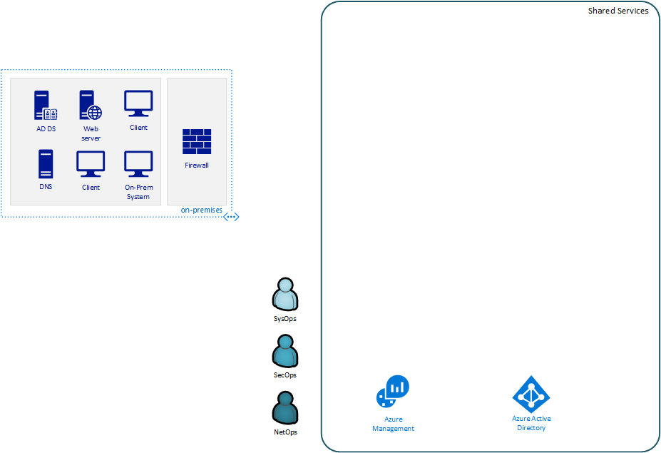
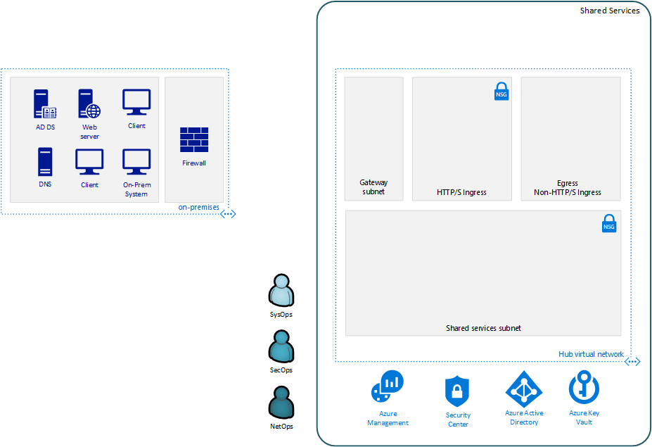
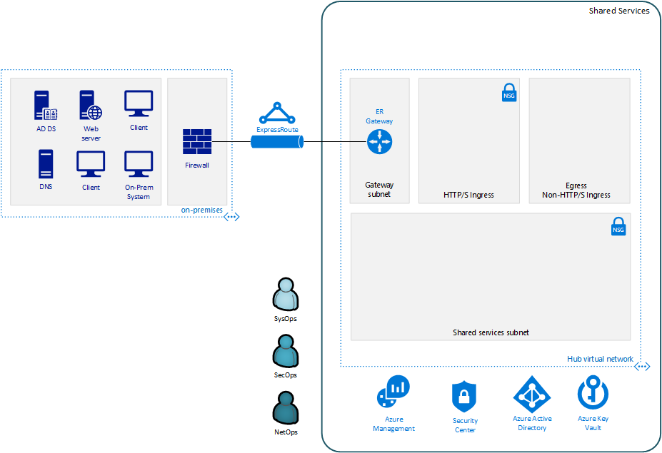
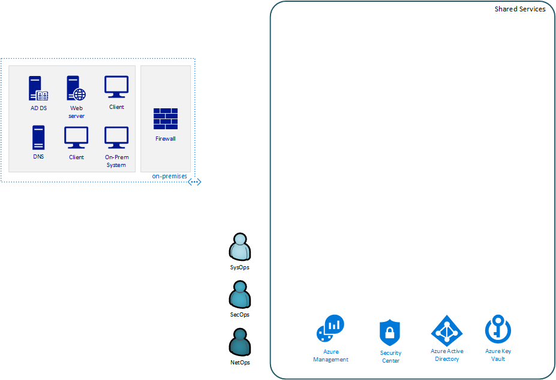
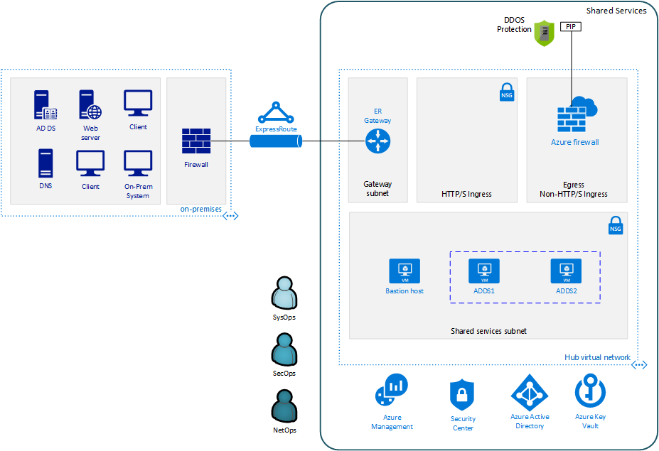
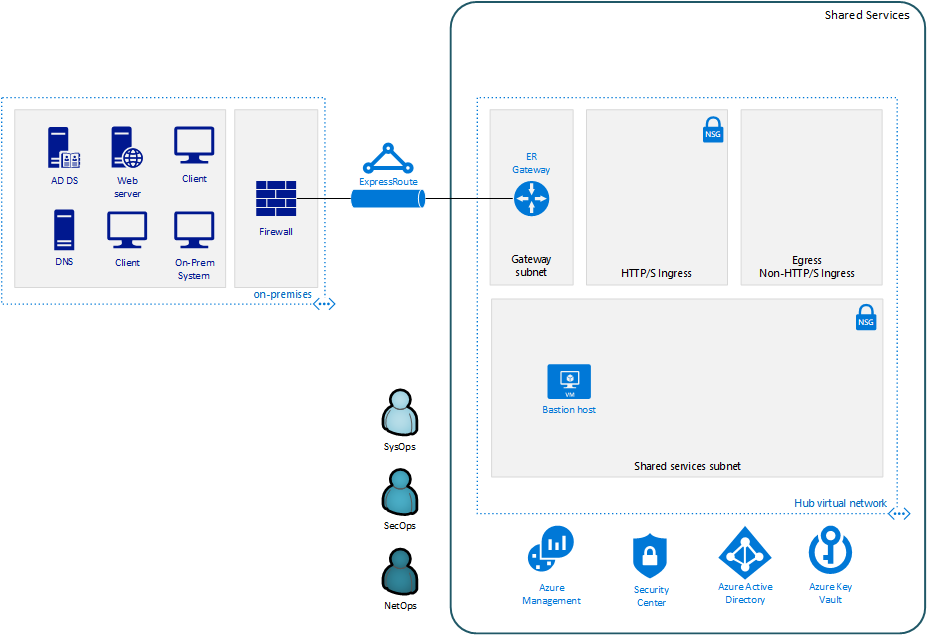
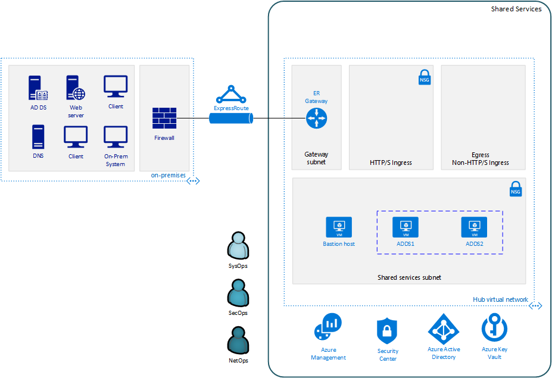

= Archetype: Shared services environment
:toc:
:toc-placement: auto
:toclevels: 2

The following sections provide a step-by-step guide to deploying VDC components using the sample deployments provided. Before starting this process, you need to make sure you have completed the following:

- Azure AD tenant configured
- Azure subscription created
- Subscription roles created

== Create your archetype configuration file

The toolkit provides an example configuration file for the shared services environment. You will need to create a new version of this file before running your deployment.

1. Navigate to the toolkit's link:../../../archetypes/shared-services[archetypes/shared-services] folder.
1. Make a copy of the `archetype.test.json` and name the copy `archetype.json`.
1. Edit `archetype.json` providing the subscription, organization, networking, and other configuration information that you want to use for your deployment. You will need to use some of the same values when creating the configuration for the shared services environment.

If your copy of the toolkit is associated with the git repository, the link:../../../.gitignore[.gitignore] file is set to prevent your deployment `archetype.json` file from being pushed to your code repository.

NOTE: The `deployment-user-id` is the user's Azure Active Directory object id.

== Run the deployment
//// 
Deploy the `shared-services` archetype by running the following command in the terminal
or command-line interface:

.Docker
[source,bash]
python vdc.py create shared-services -path archetypes/shared-services/archetype.json --upload-scripts

.Linux/OSX
[source,bash]
python3 vdc.py create shared-services -path archetypes/shared-services/archetype.json --upload-scripts

.Windows
[source,cmd]
py vdc.py create shared-services -path archetypes/shared-services/archetype.json --upload-scripts
////

== Step 1: Deploy diagnostic storage accounts

*Required role: SysOps*

The first required resource deployment is `diagnostic-storage-account` module, which deploys the Azure Storage accounts where diagnostic and metrics information will be stored.

Start the `diagnostic-storage-account` deployment by running the following command in the terminal or command-line interface:

.Docker
[source,bash]
python vdc.py create shared-services -path archetypes/shared-services/archetype.json -m diagnostic-storage-account

.Linux/OSX
[source,bash]
python3 vdc.py create shared-services -path archetypes/shared-services/archetype.json -m diagnostic-storage-account

.Windows
[source,cmd]
py vdc.py create shared-services -path archetypes/shared-services/archetype.json -m diagnostic-storage-account

This deployment creates the `{org}-{deployment-name}-la-rg` resource group that hosts the resources described in the following table.

[options="header",cols="a,,"]
|===
| Resource | Type | Description

| `{org}{deployment-name}diag{random-characters}`
| Storage accounts
| Storage accounts that stores diagnostic and metrics information.
|===

== Step 2: Deploy operations and monitoring resources

The next deployment is `la` module, which deploys the Azure Log Analytics workspace and puts policy in place requiring virtual machines deployed on the subscriptions to use Azure Monitor.

Start the `la` deployment by running the following command in the terminal or command-line interface:

.Docker
[source,bash]
python vdc.py create shared-services -path archetypes/shared-services/archetype.json -m la

.Linux/OSX
[source,bash]
python3 vdc.py create shared-services -path archetypes/shared-services/archetype.json -m la

.Windows
[source,cmd]
py vdc.py create shared-services -path archetypes/shared-services/archetype.json -m la

This deployment uses the `{org}-{deployment-name}-la-rg` resource group previously created and hosts the resources described in the following table.

[options="header",cols="a,,"]
|===
| Resource | Type | Description

| `{org}-{deployment-name}-la`
| Log Analytics
| Log Analytics instance for monitoring the shared services network.
|===

== Step 3: Deploy Virtual Machine update management

This step provisions an `automation-account` module, which deploys an Azure Automation Account and links it to a Log Analytics workspace to enable Virtual Machine update management via tags.

Start the `automation-account` deployment by running the following command in the terminal or command-line interface:

.Docker
[source,bash]
python vdc.py create shared-services -path archetypes/shared-services/archetype.json -m automation-account

.Linux/OSX
[source,bash]
python3 vdc.py create shared-services -path archetypes/shared-services/archetype.json -m automation-account

.Windows
[source,cmd]
py vdc.py create shared-services -path archetypes/shared-services/archetype.json -m automation-account

This deployment creates the `{org}-{deployment-name}-la-rg` resource group previously created and hosts the resources described in the following table.

[options="header",cols="a,,"]
|===
| Resource | Type | Description

| `{org}-{deployment-name}-automation-account`
| Automation Account
| Automation Account for patching shared services Virtual Machines.
|===

== Step 4: Deploy Azure Security Center

This step deploys `security-center` module, which enables Azure Security Center Standard tier on Storage accounts, App Service, SQL servers and Virtual machines and enables Auto Provisioning of Microsoft Monitoring agent (MMA) Virtual machine extension.

Start the `security-center` deployment by running the following command in the terminal or command-line interface:

.Docker
[source,bash]
python vdc.py create shared-services -path archetypes/shared-services/archetype.json -m security-center

.Linux/OSX
[source,bash]
python3 vdc.py create shared-services -path archetypes/shared-services/archetype.json -m security-center

.Windows
[source,cmd]
py vdc.py create shared-services -path archetypes/shared-services/archetype.json -m security-center

This deployment is a subscription deployment, therefore, no resource group gets created.

== Step 5: Deploy the virtual network

*Required role: NetOps*

This step involves two resource deployments in the following order:

- The `nsg` deployment module creates the network security groups (NSGs) and Azure security groups (ASGs) that secure the shared services virtual network.
- The `shared-services-net` deployment module creates the shared services virtual network, along with setting up the subnets and User Defined Routes (UDRs) used to route traffic coming from on-premises.
- The `enable-service-endpoint-on-diagnostic-storage-account` deployment module that enables service endpoint on the previously deployed diagnostic storage account, we cannot enable a service endpoint until after a virtual network has been created.

The virtual network is divided into four subnets:

1. _Gateway_, which hosts the virtual gateway that provides connectivity between the shared services and on-premises network.
1. _Shared services_, which host the management jump boxes and servers providing Active Directory Domain Services (ADDS) and DNS for the environments.
1. _Ingress_, which will host the Application Gateway or any NVAs and related load balancers that control and secure traffic going to any spoke workspace networks.
1. _Egress_, which will host the Azure Firewall instance that controls traffic coming from spoke networks.

NOTE: The ingress subnet will not be populated in the shared services deployment process. For the sample deployments included in the toolkit, an Azure Application Gateway gets created in this subnet as part of the first workload deployment. Subsequent workload deployments will reuse this Application Gateway.

Start the `nsg` deployment by running the following command in the terminal or command-line interface:

.Docker
[source,bash]
python vdc.py create shared-services -path archetypes/shared-services/archetype.json -m nsg

.Linux/OSX
[source,bash]
python3 vdc.py create shared-services -path archetypes/shared-services/archetype.json -m nsg

.Windows
[source,cmd]
py vdc.py create shared-services -path archetypes/shared-services/archetype.json -m nsg

Then start the `shared-services-net` deployment by running the following command in the terminal or command-line interface:

.Docker
[source,bash]
python vdc.py create shared-services -path archetypes/shared-services/archetype.json -m shared-services-net

.Linux/OSX
[source,bash]
python3 vdc.py create shared-services -path archetypes/shared-services/archetype.json -m shared-services-net

.Windows
[source,cmd]
py vdc.py create shared-services -path archetypes/shared-services/archetype.json -m shared-services-net

Finally start the `enable-service-endpoint-on-diagnostic-storage-account` deployment by running the following command in the terminal or command-line interface:

.Docker
[source,bash]
python vdc.py create shared-services -path archetypes/shared-services/archetype.json -m enable-service-endpoint-on-diagnostic-storage-account

.Linux/OSX
[source,bash]
python3 vdc.py create shared-services -path archetypes/shared-services/archetype.json -m enable-service-endpoint-on-diagnostic-storage-account

.Windows
[source,cmd]
py vdc.py create shared-services -path archetypes/shared-services/archetype.json -m enable-service-endpoint-on-diagnostic-storage-account

`shared-services-net` and `nsg` deployments creates the `{org}-{deployment-name}-net-rg` resource group that hosts the resources described in the following table.

[options="header",cols="a,,a"]
|===
| Resource | Type | Description

| `{org}-{deployment-name}-dc-asg`
| Application security group
| Application security group applied to shared services ADDS servers.

| `{org}-{deployment-name}-dmz-nsg`
| Network security group
| Network security group attached to the DMZ subnet.

| `{org}-{deployment-name}-jb-asg`
| Application security group
| Application security group applied to shared services management jump box VMs.

| `{org}-{deployment-name}-sharedsvcs-nsg`
| Network security group
| Network security group attached to the shared-services subnet.

| `{org}-{deployment-name}-sharedsvcs-udr`
| Route table
| User defined routes for routing traffic to the shared-services subnet.

| `{org}-{deployment-name}-vnet-ddos-plan`
| DDoS protection plan
| Standard Azure DDOS protection services (if enabled).

| `{org}-{deployment-name}-vnet`
| Virtual network
| The primary shared services virtual network, with the three following subnets:

- Gateway 
- DMZ 
- Shared-services
|===

== Step 6: Establish connectivity between the on-premises network and the new virtual network

*Required role: NetOps*

After deploying the shared services virtual network, you need to connect to your on-premises network. How you do this depends on the connection type you use.

=== ExpressRoute

If you’re connecting your on-premises network using ExpressRoute, you need to manually
https://docs.microsoft.com/azure/expressroute/expressroute-howto-linkvnet-portal-resource-manager[connect the shared services virtual network to your ExpressRoute circuit].

=== VPN

If your connecting to the on-premises network through a VPN connection, you can use the `vgw` deployment module to create an Azure virtual gateway in the shared services network’s gateway subnet.

Once the gateway is created, you need to configure the VPN connection between the
https://docs.microsoft.com/azure/vpn-gateway/vpn-gateway-howto-site-to-site-resource-manager-portal#VNetGateway[gateway and your on-premises VPN device].

Start the `vgw` deployment by running the following command in the terminal or command-line interface:

.Docker
[source,bash]
python vdc.py create shared-services -path archetypes/shared-services/archetype.json -m vgw

.Linux/OSX
[source,bash]
python3 vdc.py create shared-services -path archetypes/shared-services/archetype.json -m vgw

.Windows
[source,cmd]
py vdc.py create shared-services -path archetypes/shared-services/archetype.json -m vgw

This module also deploys resources into the `{org}-{deployment-name}-net-rg` resource group that hosts the resources described in the following table.

[options="header",cols="a,,a"]
|===
| Resource | Type | Description

| `{org}-{deployment-name}-gw`
| Virtual network gateway
| Gateway that allows connectivity to the on-premises network.

| `{org}-{deployment-name}--gw-pip`
| Public IP address
| Publicly accessible IP address used by the gateway.
|===

=== Connecting to simulated on-premises

If you’ve deployed the Azure hosted simulated on-premises environment, you can use the `vgw-connection` and `onprem-vgw-connection` deployment modules to finish connecting the shared services VPN gateway created by the `vgw` deployment to the simulated on-premises network.

First you need to enable the connection in the shared services environment. To do this, start the `vgw-connection` deployment by running the following command in the terminal or command-line interface:

.Docker
[source,bash]
python vdc.py create shared-services -path archetypes/shared-services/archetype.json -m vgw-connection

.Linux/OSX
[source,bash]
python3 vdc.py create shared-services -path archetypes/shared-services/archetype.json -m vgw-connection

.Windows
[source,cmd]
py vdc.py create shared-services -path archetypes/shared-services/archetype.json -m vgw-connection

Next, you’ll enable the connection on the simulated on-premises side. To do this, start the `onprem-vgw-connection` deployment by running the following command in the terminal or command-line interface:

.Docker
[source,bash]
python vdc.py create shared-services -path archetypes/shared-services/archetype.json -m onprem-vgw-connection

.Linux/OSX
[source,bash]
python3 vdc.py create shared-services -path archetypes/shared-services/archetype.json -m onprem-vgw-connection

.Windows
[source,cmd]
py vdc.py create shared-services -path archetypes/shared-services/archetype.json -m onprem-vgw-connection

== Step 7: Deploy Key Vault

*Required role: SecOps*

The next step is deploying the kv module, which creates a Key Vault resource and stores secrets defined in the `archetype.json` as well as creating encryption keys (used in Azure Disk Encryption extension), that other resources will use in subsequent deployment steps.

These values are stored as secrets in the vault. To modify the default values for these passwords edit the link:../../../modules/kv/1.0/azureDeploy.parameters.json[Key Vault (kv) module parameters file] and update the secrets-object parameter. These passwords will be used throughout the deployment process when provisioning VMs in the shared services environment and accessing on-premises resources.

Start the `kv` deployment by running the following command in the terminal or command-line interface:

.Docker
[source,bash]
python vdc.py create shared-services -path archetypes/shared-services/archetype.json -m kv

.Linux/OSX
[source,bash]
python3 vdc.py create shared-services -path archetypes/shared-services/archetype.json -m kv

.Windows
[source,cmd]
py vdc.py create shared-services -path archetypes/shared-services/archetype.json -m kv

This deployment creates the `{org}-{deployment-name}-kv-rg` resource group that hosts the resources described in the following table.

[options="header",cols="a,,"]
|===
| Resource | Type | Description

| `{org}-{deployment-name}-kv` 
| Key Vault
| Key Vault instance for the shared services. One certificate deployed by default.
|===

== Step 8: Deploy Azure Firewall

*Required role: SecOps*

In addition to NVAs that control and secure traffic between the on-premises and the other networks, the toolkit uses Azure Firewall to provide restricted access to the Internet from all environments deployed by the toolkit.

Start the `azure-fw` deployment by running the following command in the terminal or command-line interface:

.Docker
[source,bash]
python vdc.py create shared-services -path archetypes/shared-services/archetype.json -m azure-fw

.Linux/OSX
[source,bash]
python3 vdc.py create shared-services -path archetypes/shared-services/archetype.json -m azure-fw

.Windows
[source,cmd]
py vdc.py create shared-services -path archetypes/shared-services/archetype.json -m azure-fw

This module also deploys resources into the `{org}-{deployment-name}-net-rg` resource group that hosts the resources described in the following table.

[options="header",cols="a,,a"]
|===
| Resource | Type | Description

| `{org}-{deployment-name}-az-fw`
| Firewall
| Azure Firewall instance used for any required access to the Internet.

| `{org}-{deployment-name}-az-fw-pip`
| Public IP address
| Public IP address used by the firewall.
|===

== Step 9: Deploy management jump boxes

*Required role: SysOps*

To manage resources in the shared services environment, such as NVA devices from on-premises, you need virtual machines serving as secure bastion hosts deployed in the shared services network that you can use as jump boxes to remotely access these services.

The `jb` deployment module creates one Windows virtual machine and one Linux virtual machine in the shared-services subnet that serve as secure management jump boxes.

Start the `jb` deployment by running the following command in the terminal or command-line interface:

.Docker
[source,bash]
python vdc.py create shared-services -path archetypes/shared-services/archetype.json -m jb -–upload-scripts

.Linux/OSX
[source,bash]
python3 vdc.py create shared-services -path archetypes/shared-services/archetype.json -m jb -–upload-scripts

.Windows
[source,cmd]
py vdc.py create shared-services -path archetypes/shared-services/archetype.json -m jb -–upload-scripts

Because the jump box virtual machines require post-deployment configuration using custom scripts, use the `-–upload-scripts` argument when running the deployment to ensure the latest scripts are copied to the shared Azure Storage location.

The jump box virtual machine will create a local admin user based on the `local-admin-user` value set in your shared services configuration file, with a password stored in the shared services key vault.

This deployment creates the `{org}-{deployment-name}-jb-rg` resource group that hosts the resources described in the following table.

[options="header",cols="a,,a"]
|===
| Resource | Type | Description

| `{org}{deployment-name}jbdiag{random characters}` (with any dashes removed)
| Storage accounts
| Storage accounts used to store diagnostic logs related to the jump box virtual machines.

| `{org}-{deployment-name}-jb-linux-as`
| Availability set
| Availability set for Linux jump box virtual machines.

| `{org}-{deployment-name}-jb-linux-vm1`
| Virtual machine
| Linux virtual machine jump box.

| `{org}-{deployment-name}-jb-linux-vm1-nic`
| Network interface
| Virtual network interface for Linux virtual machine jump box.

| `{org}-{deployment-name}jblinuxvm1osdisk{random-characters}`
| Disk
| Virtual OS disk used by the Linux jump box virtual machine.

|`{org}-{deployment-name}-jb-win-as`
| Availability set
| Availability set for Windows jump box virtual machines.

| `{org}-{deployment-name}-jb-win-vm1`
| Virtual machine
| Windows virtual machine jump box.

| `{org}-{deployment-name}-jb-win-vm1-nic`
| Network interface
| Virtual network interface for Windows virtual machine jump box.

| `{org}-{deployment-name}jbwinvm1osdisk{random-characters}`
| Disk
| Virtual OS disk used by the Windows jump box virtual machine.
|===

== Step 10: Deploy ADDS servers

*Required role: NetOps*

The shared services environment is meant to provide DNS services and domain integration with on-premises directory servers for workload environments deployed by the toolkit.

The `adds` deployment module creates a pair of Windows servers providing Active Directory Domain Services (ADDS) integrated with an on-premises Active Directory server and provides DNS services.

The ADDS server virtual machines will create a local admin user based on the `local-admin-user` value set in your shared services configuration file, with a password stored in the shared services key vault. In addition, it will use the `domain-admin-user` account from the configuration file to join these virtual machines to your simulated on-premises domain.

As the ADDS servers require the installation of several Azure virtual machine extensions, this deployment can take several hours to complete.

NOTE: In order for this deployment to complete successfully, you must have successfully established connectivity with your on-premises network (Step 5) to allow the newly deployed ADDS servers to communicate with your on-premises domain servers. Also, make sure the on-premises related information in the shared services archetype configuration file (`archetype.json`) is accurate.

Start the `adds` deployment by running the following command in the terminal or command-line interface:

.Docker
[source,bash]
python vdc.py create shared-services -path archetypes/shared-services/archetype.json -m adds -–upload-scripts

.Linux/OSX
[source,bash]
python3 vdc.py create shared-services -path archetypes/shared-services/archetype.json -m adds -–upload-scripts

.Windows
[source,cmd]
py vdc.py create shared-services -path archetypes/shared-services/archetype.json -m adds -–upload-scripts

Because the ADDS virtual machines require post-deployment configuration using custom scripts, use the `-–upload-scripts` argument when running the deployment to ensure the latest scripts are copied to the shared Azure Storage location.

This deployment creates the `{org}-{deployment-name}-ad-rg` resource group that hosts the resources described in the following table.

[options="header",cols="a,,a"]
|===
| Resource | Type | Description

| `adds1osdsk\{random-characters}`
| Disk
| Virtual OS disk for primary ADDS server.

| `adds1dsk1\{random-characters}`
| Disk
| Virtual data disk for primary ADDS server.

| `adds2osdsk\{random-characters}`
| Disk
| Virtual OS disk for secondary ADDS server.

| `adds2dsk1\{random-characters}`
| Disk
| Virtual data disk for secondary ADDS server.

| `{org}-{deployment-name}-adds-as`
| Availability set
| Availability set for ADDS servers.

| `{org}-{deployment-name}addsdiag{random-characters}` (with any dashes removed)
| Storage accounts
| Storage accounts used to store diagnostic logs related to the ADDS servers.

|`{org}-{deployment-name}-adds-vm1`
| Virtual machine
| Primary ADDS server.

| `{org}-{deployment-name}-adds-vm1-nic`
| Network interface
| Virtual network interface for primary ADDS server.

| `{org}-{deployment-name}-adds-vm2`
| Virtual machine
| Secondary ADDS server.

| `{org}-{deployment-name}-adds-vm2-nic`
| Network interface
| Virtual network interface for secondary ADDS server.
|===

== Next steps

- Review the link:parameters.adoc[parameter settings] for the archetype.
- Review the link:on-premises-requirements.adoc[requirements for the on-premises environment].
