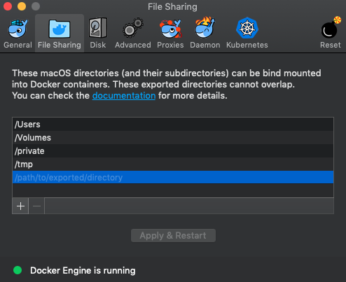

# Running from Docker

We recommend using the Docker image to run the toolkit. The Docker image will provide all of the prerequisites for running the toolkit, including the Azure CLI.

> If you prefer to run the toolkit without Docker, please see these [instructions](./setup-local.md).

The basic steps are:

1. Download the source files for the toolkit
1. Ensure Docker is install
1. Configure Docker for your host OS
1. Build the Docker image for the toolkit
1. Run the Docker image to access the toolkit

## Preparing to run the Docker image

If you don't already have Docker, we recommend [installing Docker Desktop](https://docs.docker.com/install/).

You should acquire the source files for the toolkit by either [cloning the repository](https://help.github.com/articles/cloning-a-repository/) or downloading the zip file.

> We recommend storing the files in a location with a short path (i.e., `c:\source\vdc` on Windows) because you'll need to type the path when running the container.

Docker will need to access one or more local folders. To do this, modify your Docker settings for file sharing. Specifically, the container will to need access to the folder where the toolkit source files are located.



> For more details, please see the Docker documentation for your OS: [📄 Windows](https://docs.docker.com/docker-for-windows/) [📄 Mac](https://docs.docker.com/docker-for-mac/)

### Build the Docker image

1. Open up a terminal or command line interface
1. Navigate to the folder where the toolkit source files are located. This folder contains the `dockerfile` file.
1. Execute the [build](https://docs.docker.com/engine/reference/commandline/build/) command:

    `docker build . -t vdc:latest`

    This creates a Docker image on your local machine named `vdc:latest`. This command may take a few minutes to complete.

You will only need to build the image when there are changes to the toolkit sources files. After the image is built, you will run it to access the toolkit.

## Running the Docker image

> For **Windows** users:
>
> When providing a path to Docker, you will need to provide `/` instead of `\`.
>
> For example, the path `c:\source\vdc` should be written as `c:/source/vdc`.

NOTE: Avoid using Git Bash for the commands below. As seen in [this open issue](https://github.com/docker/toolbox/issues/673), running a Docker container from Git Bash is not currently supported. 

To run the Docker image use:

  `docker run -it --rm -v [path-to-modules]:/usr/src/app/modules -v [path-to-archetypes]:/usr/src/app/archetypes -v [path-to-roles]:/usr/src/app/roles vdc:latest`

You will need to replace `[path-to-modules]`, `[path-to-roles]` and `[path-to-archetypes]` with the corresponding local paths. These are both subfolders in toolkit repository. For example, if you are on Windows and downloaded the source to `c:\source\vdc` then the full command would be:

  `docker run -it --rm -v c:/source/vdc/modules:/usr/src/app/modules -v c:/source/vdc/archetypes:/usr/src/app/archetypes -v c:/source/vdc/roles:/usr/src/app/roles vdc:latest`

After running the container, you will be presented with a bash prompt `bash-4.4#`. If you run the command `ls`,  you should see a list of files and folders from the toolkit repository similar to this:

```terminal
LICENSE               dockerfile            executables
orchestration         role_creation.py      setup.py
vdc.py                README.md             documentation
logging               policy_assignment.py  roles
subscription.py       archetypes            exceptions
modules               requirements.txt      scripts
tools
```

> In order to execute the unit tests and integrations from inside the container, you will also need to mount the [tests](../tests) folder: `-v [path-to-tests]:/usr/src/app/tests`

## Regarding mounting folders

The Docker image does not contain the following folders:

- [`archetypes`](../../archetypes)
- [`modules`](../../modules)
- [`roles`](../../roles)
- [`tests`](../../tests)

These folders are explicitly ignored in the [.dockerignore](../.dockerignore) file.

The recommended usage pattern is to mount the needed folders when running the image. However, if you prefer not to mount local volumes, remove `.dockerignore` file and rebuild the Docker image to include any new changes made to your local copy of modules, archetypes and tests files.

## Next steps

> Throughout the remainder of this documentation, be sure to use the commands labelled `[Docker]`.

You are now ready to start [your first deployment](../use/your-first-deployment.md).
