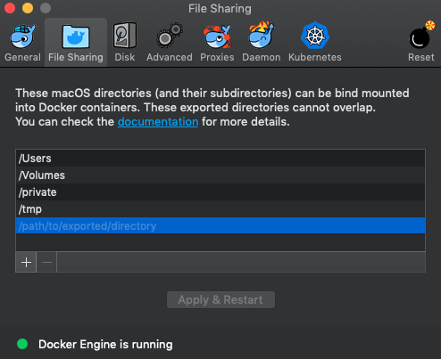

# Prerequisites

## Knowledge requirements

Before deploying a VDC, familiarize yourself with the following Azure
technologies and services used by the Virtual Datacenter Automation Toolkit:

-   [Azure Resource
    Manager (ARM) Templates](https://docs.microsoft.com/azure/azure-resource-manager/resource-group-authoring-templates) *(Advanced knowledge)*

-   [Azure Resource
    Manager](https://docs.microsoft.com/azure/azure-resource-manager/resource-group-overview)

-   [Azure
    CLI](https://docs.microsoft.com/cli/azure/overview?view=azure-cli-latest)

-   [Azure subscriptions and Azure Active
    Directory](https://docs.microsoft.com/azure/active-directory/active-directory-how-subscriptions-associated-directory)
    *(Azure AD)*

-   [Azure Key
    Vault](https://docs.microsoft.com/azure/key-vault/key-vault-whatis)

-   [Azure
    Policy](https://docs.microsoft.com/azure/azure-resource-manager/resource-manager-policy)

-   [Role-based access control
    (RBAC)](https://docs.microsoft.com/azure/active-directory/role-based-access-control-configure)

-   [Azure Load
    Balancer](https://docs.microsoft.com/azure/load-balancer/load-balancer-overview)

-   [Azure Application Gateway](https://azure.microsoft.com/services/application-gateway/)

-   [Route
    tables](https://docs.microsoft.com/azure/virtual-network/tutorial-create-route-table-portal)

-   [Network security
    groups](https://docs.microsoft.com/azure/virtual-network/virtual-networks-nsg)
    *(NSGs)*

-   [Application security
    groups](https://docs.microsoft.com/azure/virtual-network/security-overview#application-security-groups)
    (ASGs)

-   [Azure Firewall](https://azure.microsoft.com/services/azure-firewall/)

-   [Virtual machines](https://docs.microsoft.com/azure/virtual-machines/)

-   [Virtual
    networks](https://docs.microsoft.com/azure/virtual-network/virtual-networks-overview)
    *(VNets)*

-   [ExpressRoute](https://azure.microsoft.com/services/expressroute/)

-   [VPN
    gateways](https://docs.microsoft.com/azure/vpn-gateway/vpn-gateway-about-vpngateways)

-   [Azure App Service
    Environments](https://docs.microsoft.com/azure/app-service/environment/intro)
    (AESs)

-   [Azure SQL
    Database](https://azure.microsoft.com/services/sql-database/)

## Azure requirements

Before starting a VDC deployment, you must validate your Azure environment
configuration and ensure it meets the prerequisites in the following table.
<table>
<tr><th>Prerequisite </th><th>Description</th></tr>
<tr>
<td>Provision an Azure AD tenant</td>
<td>The VDC needs an Azure AD tenant for consistent authentication and access control across the entire the virtual datacenter. Your organization needs to have an <a href="https://docs.microsoft.com/azure/active-directory/develop/active-directory-howto-tenant">Azure AD tenant</a> in place before you can begin the process of deploying a VDC. </td>
</tr>
<tr>
<td>Create an Azure subscription</td>
<td>Before you begin the deployment process, you need an Azure subscription to host your VDC resources. These subscriptions must be associated with your organization's Azure AD tenant. The Azure account owner for your organization needs to provision these subscriptions before you begin the deployment process.  </td>
</tr>
<tr>
<td>Ensure subscription quotas are sufficient</td>
<td>VDC automation deployment scripts can fail if the resources you deploy exceed the standard Azure <a href="https://docs.microsoft.com/azure/azure-subscription-service-limits">subscription limits and quotas</a>. Make sure the resources you deploy do not exceed these quotas or limits. It's recommended that you use an empty subscription when creating a new VDC shared services or workload deployment.  </td>
</tr>
<tr>
<td>Enable Azure Firewall on your subscription</td>
<td>The VDC automation toolkit uses the new Azure Firewall to enable secure internet access for the shared services network. Azure Firewall is currently in public preview, and you will need to <a href="https://docs.microsoft.com/azure/firewall/public-preview">enable it on your subscription</a> before deploying the VDC shared services infrastructure. </td>
</tr>
<tr>
<td>Confirm IP ranges do not conflict</td>
<td>To interact with your on-premises network, your central IT shared services and workload networks need to have a compatible IP address configuration. IP ranges for the shared services and workloads should not conflict with each other or any on-premises datacenters the VDC connects with. Integrate the networks in your VDC with your existing on-premises IP Address Management (IPAM) scheme before choosing the IP ranges for the main central IT shared services and any planned workload networks you plan to deploy.</td>
</tr>
<tr>
<td>Determine roles</td>
<td>By default, a VDC provides four roles that are assigned appropriate access to the relevant Azure resources:                 <ul>
<li>SecOps - Security</li>
<li>NetOps - Networking</li>
<li>SysOps - Infrastructure monitoring</li>
<li>DevOps - Development (not used in the central IT infrastructure and network)</li>
</ul> </td>
</tr>
</table>

Before deploying your VDC, you need to create the appropriate roles in your
subscription and identify which users need to be assigned to each role.

For a detailed listing of the permissions these roles should be granted, [see
the discussion on roles](02-how-vdc-automation-works.md#roles-and-permissions) later in this guide. Also, see the
[Creating subscription roles](04-creating-subscription-roles.md) section for
instructions on using the provided scripts to deploy roles for your
subscription.

## On-premises connectivity requirements

The VDC Automation Toolkit assumes you will be connecting the VDC to an
on-premises network with domain services running. Connecting a VDC deployment
requires you to use one of the mechanisms in the following table to connect your
on-premises network and the VDC.

| **Connection method**                                                                                 | **Description**                                                                                                                                                                                                                                                                                                                                                                                                                                                                                                                                                        |
|-------------------------------------------------------------------------------------------------------|------------------------------------------------------------------------------------------------------------------------------------------------------------------------------------------------------------------------------------------------------------------------------------------------------------------------------------------------------------------------------------------------------------------------------------------------------------------------------------------------------------------------------------------------------------------------|
| [Azure VPN gateway](https://docs.microsoft.com/azure/vpn-gateway/vpn-gateway-about-vpngateways) | VPN gateways create a site-to-site connection that passes encrypted traffic over the public Internet. This method requires a [supported VPN device](https://docs.microsoft.com/azure/vpn-gateway/vpn-gateway-about-vpn-devices) hosted in your on-premises data center that the Azure VPN gateway deployed in the VDC can connect to.                                                                                                                                                                                                                            |
| [ExpressRoute](https://docs.microsoft.com/azure/expressroute/)                                  | ExpressRoute uses a dedicated, private connection facilitated by a connectivity provider. For security and performance purposes, most organizations prefer ExpressRoute connections, but these take several weeks to provision, so in many cases VPN connections are used as a bootstrap connection until an ExpressRoute connection is available. You need to create an [ExpressRoute connection in Azure](https://docs.microsoft.com/azure/expressroute/expressroute-howto-circuit-portal-resource-manager) before you can use it as part of a VDC deployment. |

For testing purposes, the Azure Virtual DataCenter Automation Toolkit includes
the scripts necessary to [create a simulated on-premises environment](06-deploying-the-simulated-on-premises-environment.md) hosted on Azure and
automatically connect it to your VDC shared services network using a VPN gateway (Vnet-2-Vnet connection type).

If you plan to connect a VDC to your actual on-premises environment, you will
need to manually configure ExpressRoute or VPN connections after creating the
shared services virtual network. You must establish these connections before any VDC
resources can join the on-premises domain or make use of any other on-premises
resources.

## Software requirements

To run VDC automation scripts, you need to have a modern Windows, Linux, or Mac
computer with the software listed in the following table installed.

| **Prerequisite** | **Minimum version**                         |
|------------------|---------------------------------------------|
| Azure CLI        | 2.0.34                                     |
| Python           | 3.6 (3.7 not yet supported)  Python modules: &nbsp;&nbsp;&nbsp;&nbsp;-azure-mgmt-resource &nbsp;&nbsp;&nbsp;&nbsp;-azure &nbsp;&nbsp;&nbsp;&nbsp;-azure-cli-core &nbsp;&nbsp;&nbsp;&nbsp;-adal &nbsp;&nbsp;&nbsp;&nbsp;-argparse &nbsp;&nbsp;&nbsp;&nbsp;-python-interface &nbsp;&nbsp;&nbsp;&nbsp;-azure_devtools &nbsp;&nbsp;&nbsp;&nbsp;-pytest &nbsp;&nbsp;&nbsp;&nbsp;-PyGithub &nbsp;&nbsp;&nbsp;&nbsp;-jinja2 &nbsp;&nbsp;&nbsp;&nbsp;-GitPython &nbsp;&nbsp;&nbsp;&nbsp;-requests |

## VDC Automation Toolkit Docker image

While you can install the required software and run the scripts on your local
machine, the VDC deployment automation package contains a [Dockerfile
configuration](../dockerfile)
that allows you to create a Docker image containing the VDC deployment automation engine.

The repository contains a [.dockerignore](../.dockerignore) that ignores [modules](../modules), [archetypes](../archetypes) and [tests](../tests) files.

Modules folder contains all the different VDC modules, such as net (containing VNET deployment), nsg (containing NSG and ASG deployments), etc.

Archetypes folder contains all the different archetype configuration files (archetype.json), each configuration file contains deployment specific information (such as network information, tenant, subscription information, etc.) 

Note: If you are using Docker for Windows, you will need to use a Linux-based container.

If you have [Docker installed](https://docs.docker.com/install/), follow these
steps to build the Docker image:

1.  Open up a terminal/command-line interface and navigate to the location where
    you extracted the VDC deployment automation files.

2.  Build a Docker image by running the following command:
    >   *docker build -t [Image name of your choice] .*

    Using the included Dockerfile, the image gets created with Python and Azure CLI preinstalled, additionally, all the required VDC deployment automation engine files are copied to the image.

3.  Run the newly created image using the following command:  

    >   *docker run -v [Modules path]:/usr/src/app/modules -v [Archetypes path]:/usr/src/app/archetypes -it [Image name of your choice]*

    Considerations for Docker containers running in Windows:
    
    1. [Modules path] and [Archetypes path] should contain the hard drive information and the path should be in Linux format (i.e. c:/source/vdc/modules)
    2. Make sure to clone the VDC repo in a folder different than the Windows desktop folder (i.e. clone the repo in C:\source\vdc).
    3. In case unit tests are executed inside the container, make sure to mount [tests](../tests) local folder

    Consideration for Docker containers running in Windows, Linux or MacOS:

    1. Since running the containers requires mounting local drives, make sure to grant folder access to Docker.

    

During the image build, Docker pulls in a [requirements.txt](../requirements.txt) file which lists the Python modules required to run the toolkit. These modules are automatically installed as the image is built. This requirements.txt file can also be used to create a [virtual Python environment](https://docs.python.org/3/tutorial/venv.html) on your local machine.
When running the VDC deployment automation engine without using a container, it is recommended to create a virtual environment to prevent package versioning conflicts. 

**Note:** If you prefer not to mount local volumes, remove .dockerignore file and make sure to rebuild the Docker image to include any new changes made to your local copy of modules, archetypes and tests files.
