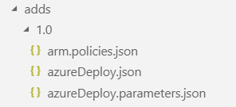

# How VDC automation works

The Azure Virtual Datacenter Automation Toolkit facilitates the deployment and
configuration of all the Azure resources necessary to create a trusted network
extension to your on-premises network.

Automation makes use of Python scripts to process deployment templates and
parameters files. These scripts use a top-level deployment configuration file to
populate values in individual resource-level parameters files, which are then
passed along with the relevant resource deployment templates and submitted as a
Resource Manager deployment.

## Deployment types 

VDC automation supports three types of root level deployments, which form the
basis of VDC automation.

| **Deployment type** | **Description**                                                                                                                                       |
|---------------------|-------------------------------------------------------------------------------------------------------------------------------------------------------|
| shared-services                 | Provisions the central IT and security infrastructure, shared services virtual network, and on-premises connectivity for your VDC.                                |
| workload               | Deploys a workload virtual network where resources are deployed and securely connects this network to shared services network.                                  |
| on-premises         | Creates an Azure hosted simulated on-premises environment for testing VDC automation without needing to connect to your actual on-premise resources. |

## Sample deployments

A VDC deployment uses a deployment configuration file (archetype.json) which defines the unique settings and configuration for shared services, workload, or sample on-premises resources you're deploying. These configuration files reference resource deployment modules, which are the building blocks the automation scripts use to provision specific resources on the azure platform.

The toolkit provides several sample deployments built for Contoso, a fictional
organization. You can use these samples for testing VDC automation and as a
starting point for creating your own custom deployments.

| **Sample Deployment**                                                                                                                                                   | **Description**                                                                                                |
|-------------------------------------------------------------------------------------------------------------------------------------------------------------------------|----------------------------------------------------------------------------------------------------------------|
| [shared-services](../archetypes/shared-services)                                   | A basic VDC shared services environment providing secure on-premises connectivity and central controls for the entire VDC. |
| [paas](../archetypes/paas)                     | A simple PaaS workload environment using SQL Azure and secured App Service Environments.                       |
| [iaas](../archetypes/iaas)                     | An n-tier workload environment using VMs and load balancers.                                                   |
| [cloudbreak](../archetypes/cloudbreak) | A workload environment hosting a Cloudbreak managed HDP Hadoop cluster.                                        |
| [sap-hana](../archetypes/sap-hana) | A workload environment hosting an SAP HANA environment.                                        |
| [on-premises](../archetypes/on-premises)            | An Azure hosted simulated Contoso on-premises environment.                                                     |

## Resource deployment modules

Shared services, workload, or simulated on-premises deployments make use of a collection of resource deployment modules to perform specific provisioning, configuration, and resource deployment tasks. 

Individual deployment modules are organized around functional parts of the VDC. For example, one module deploys a Key Vault instance, another module deploys a virtual network, and a third module creates a workload specific virtual machine. The modules used in a deployment are defined in the [deployment configuration file](03-parameters-files.md#common-network-parameters).

Module versioning is supported using a version subfolder structure inside the main module folder (version folder named in #.# format, such as "1.0", "1.5", etc. **Version is a string value, so it can be any alphanumeric value**). The JSON files that make of the module are located in these version folders.

These module files consist of a Resource Manager template (azureDeploy.json) used to deploy resources, and a parameter file associated with the deployment file (azureDeploy.parameters.json), and an optional policies file (arm.policies.json) that can apply Azure Policy rules as part of the deployment. These files are standard Azure Resource Manager (ARM) template files that have been modified to make use of the [VDC automation toolkit's custom parameter format](03-parameter-files.md#referencing-parameters).

*Example module folder structure*

When the automation toolkit's deployment scripts are run these module files are used to create a Resource Manager deployment. Custom parameters are populated in these templates using values set in the top-level deployment parameters file before being submitted to the ARM API for deployment. For example, a virtual network IP range defined in the top-level parameters file will be inserted into the individual resource parameters file where appropriate before submitting that deployment to Azure Resource Manager.

### Sample deployment modules

The VDC Automation Toolkit includes deployment modules to support each of the sample deployments. These modules are stored in the modules folder.

#### Shared services deployment modules

The following resource deployments modules support shared services deployments:

| **Resource** | **Role** | **Description**                                    |
|--------------|----------|----------------------------------------------------|
| ops          | SysOps   | Operations and monitoring resources.               |
| kv           | SecOps   | Central Key Vault deployment and key provisioning. |
| nsg          | NetOps   | Shared services virtual network NSG and ASG configuration.     |
| net          | NetOps   | Shared services virtual network creation.                      |
| vgw          | NetOps   | Virtual gateway creation.                          |
| jb           | SysOps   | Bastion hosts for remote management (jump boxes).  |
| adds         | NetOps   | Shared services domain and DNS servers.                        |
| app-gateway  | SecOps   | Azure Application Gateway used as a central firewall for incoming traffic.  |
| azure-fw     | SecOps   | Azure Firewall creation.                           |

#### Workload deployment modules

The following resource deployments modules support workload deployments:

| **Resource**       | **Role** | **Description**                                                                                                                                                            |
|--------------------|----------|----------------------------------------------------------------------------------------------------------------------------------------------------------------------------|
| ops                | SysOps   | Operations and monitoring resources. (used in all workload deployments)                                                                                                       |
| nsg                | NetOps   | Workload virtual network NSG and ASG configuration. (used in all workload deployments)                                                                                           |
| net                | NetOps   | Workload virtual network creation. (used in all workload deployments)                                                                                                            |
| kv                 | SecOps   | Workload Key Vault deployment. (used in all workload deployments)                                                                                                                |
| app-gateway        | NetOps   | Example deployment of an Application Gateway to the Shared Services (used by iaas sample). **Note:** App-gateway deployment, deploys the resource in the Shared Services subscription, therefore a NetOps role must have the appropriate deployment permissions on both subscriptions: Shared services and Workload subscription.                                                                                    |
| vmapp-lb           | DevOps   | Example infrastructure as a service (IaaS) workload deployment using dual Windows Server machines with load balancer and availability set. (used by the iaas sample) |
| sqlserver-alwayson | DevOps   | Example IaaS workload deployment using dual Windows Server machines running SQL Server with load balancer and availability set. (used by the iaas sample)            |
| sqldb              | DevOps   | Example platform as a service (PaaS) workload deployment using Azure SQL Database. (used by the paas sample)                                                         |
| ase                | DevOps   | Example PaaS workload using an App Services Environment deployment. (used by the paas sample)                                                                        |
| cb  | DevOps   | Example Hadoop workload. (used by the cloudbreak sample)                                                                                                         |
| kdc                | DevOps   | Example Kerberos domain controller deployment. (used by the cloudbreak sample)                                                                                   |
| iscsi              | DevOps   | Example virtual iSCSI array deployment. (used by the sap-hana sample)                                                                                                |
| nfs                | DevOps   | Example NFS servers. (used by the sap-hana sample)                                                                                                                   |
| hana               | DevOps   | Example SAP HANA deployment. (used by the sap-hana sample)                                                                                                           |
| ascs               | DevOps   | Example SAP ASCS server deployment. (used by the sap-hana sample)                                                                                                    |
| netweaver          | DevOps   | Example SAP NetWeaver deployment. (used by the sap-hana sample)                                                                                                      |

#### Simulated on-premises modules

The following resource deployments modules support deploying a simulated on-premises environment:

| **Resource** | **Description**                                                                 |
|--------------|---------------------------------------------------------------------------------|
| nsg          | Simulated on-premises virtual network NSG and ASG configuration.                |
| net          | Simulated on-premises virtual network.                                          |
| ad           | Simulated on-premises active directory servers.                                 |
| vgw          | Virtual gateway used to connect the simulated on-premises network with the shared services network. |

### Resource dependencies and deployment output

Resource deployment modules can depend on other resources provisioned earlier in the overall deployment process. For instance, the virtual machines in the ADDS deployment module can't be created without first creating the required on-premises connected virtual network.

Deployment modules may need to know the names and settings of resources created by deployments they depend on. To provide this information, the VDC automation process uses the output generated by Azure Resource Manager from each resource deployment.

To share this output between resource deployments, the automation script creates a shared Azure Storage location in your subscription. Deployment output is written to the location, and subsequent resource deployments can load this output and integrate these settings with its own deployment parameters.

By default, the first time a resource deployment script is run, a new resource group named *vdc-storage-rg* is created in the target subscription. All VDC deployments use this resource group when creating storage accounts for saving deployment output. Storage account names can be specified using the *vdc-storage-account-name* parameter in the shared services or workload configuration file.

Note that workload deployments may rely on output generated during the shared services deployment, so must use the same storage account used by their associated shared services to access that output.

### Virtual machine configuration scripts

Certain resources, particularly virtual machines that require configuration after creation, may need additional scripts or other files included as part of their Resource Manager deployment. These files are stored in the "/scripts" folder of the toolkit folder, and they need to be uploaded to the same storage account as the deployment output before submitting the deployment to Resource Manager.

By default, resource deployments do not upload these scripts. For resource deployment modules that require these scripts, use the "--upload-scripts" argument when launching the automation script to upload these scripts to the correct location. Every time this upload process is performed, the entire contents of the /scripts folder is copied to storage, overwriting any previous versions.

## Roles and permissions

Integrated into the VDC deployment automation strategy is the concept of
separation of responsibilities using role-based access control (RBAC) to
determine which users and teams can create and manage specific resources and
components of a VDC.

Before deploying, you need to create the appropriate roles in your Azure AD
tenant and assign the appropriate users to these roles. See the [Creating
subscription roles](04-creating-subscription-roles.md) section for instructions on
using the provided scripts to deploy roles for your subscription.

The VDC model assumes a breakdown of users into the roles described in the
following table.

| **Role** | **Azure permissions**                                                                                                                                                                                                                                                                                                                                                                                                                                                                                                                                                                                                                                                                                                                                                                                                                                                                                                                                                                                                                                                                                                                                                                                                        | **Description**                                                                                                                                                                                                                                                                                                                                                                                                                                                                                                                                                                                                                                                                                                                                                                                                                                                                                                                                                                                                                                                                                                                                                                                                           |
|----------|------------------------------------------------------------------------------------------------------------------------------------------------------------------------------------------------------------------------------------------------------------------------------------------------------------------------------------------------------------------------------------------------------------------------------------------------------------------------------------------------------------------------------------------------------------------------------------------------------------------------------------------------------------------------------------------------------------------------------------------------------------------------------------------------------------------------------------------------------------------------------------------------------------------------------------------------------------------------------------------------------------------------------------------------------------------------------------------------------------------------------------------------------------------------------------------------------------------------------|---------------------------------------------------------------------------------------------------------------------------------------------------------------------------------------------------------------------------------------------------------------------------------------------------------------------------------------------------------------------------------------------------------------------------------------------------------------------------------------------------------------------------------------------------------------------------------------------------------------------------------------------------------------------------------------------------------------------------------------------------------------------------------------------------------------------------------------------------------------------------------------------------------------------------------------------------------------------------------------------------------------------------------------------------------------------------------------------------------------------------------------------------------------------------------------------------------------------------|
| SecOps   | Microsoft.Insights/diagnosticsettings/write  Microsoft.key vault/hsmPools/read  Microsoft.key vault/hsmPools/write  Microsoft.key vault/vaults/read  Microsoft.key vault/vaults/write  Microsoft.key vault/vaults/secrets/read  Microsoft.key vault/vaults/secrets/write  Microsoft.key vault/vaults/accessPolicies/write  Microsoft.Compute/availabilitySets/write  Microsoft.Compute/locations/operations/read  Microsoft.Compute/virtualMachines/extensions/read  Microsoft.Compute/virtualMachines/extensions/write  Microsoft.Compute/virtualMachines/read  Microsoft.Compute/virtualMachines/write  Microsoft.Network/loadBalancers/write  Microsoft.Network/locations/operations/read  Microsoft.Network/networkInterfaces/write  Microsoft.Network/publicIPAddresses/write  Microsoft.Network/routeTables/read  Microsoft.Network/routeTables/write  Microsoft.Storage/storageAccounts/read  Microsoft.Storage/storageAccounts/write  Microsoft.Resources/deployments/read  Microsoft.Resources/deployments/write  Microsoft.Authorization/policyAssignments/write  Microsoft.Authorization/policyDefinitions/write  Microsoft.Authorization/roleDefinitions/read  Microsoft.Authorization/roleDefinitions/write                                       | The SecOps role is responsible for security within the central IT infrastructure and shared services virtual network. This includes managing security devices, keys, and secrets, along with controlling user access to the environment. SecOps is responsible for monitoring traffic coming from outside the VDC environment and between the workspaces and the central IT infrastructure for potential attacks or vulnerabilities, as well as controlling what external internet locations are accessible from inside the VDC. Security policies and access rules at the resource group and individual resources level are managed by SecOps, and any workload requests for exceptions or modifications of these policies and rules is handled by SecOps. SecOps is responsible for administrating the central IT Key Vault. SecOps can create, modify, and read secrets and cryptographic keys in the vault, while other roles can only use items in the vault to encrypt/decrypt data in the virtual datacenter. Because all traffic going into and out of a VDC must pass through the central firewall, the central IT SecOps role is responsible for managing requests from workload teams to modify central firewall settings. |
| NetOps   | Microsoft.Network/applicationSecurityGroups/write  Microsoft.Network/networkSecurityGroups/write  Microsoft.Network/ddosProtectionPlans/write  Microsoft.Network/locations/operations/read  Microsoft.Network/publicIPAddresses/write  Microsoft.Network/routeTables/read  Microsoft.Network/routeTables/write  Microsoft.Network/virtualNetworks/read  Microsoft.Network/virtualNetworks/write Microsoft.Network/azureFirewalls/read Microsoft.Network/azureFirewalls/write Microsoft.Network/applicationGateways/read Microsoft.Network/applicationGateways/write Microsoft.Network/virtualNetworks/virtualNetworkPeerings/write  Microsoft.key vault/vaults/read  Microsoft.key vault/vaults/write  Microsoft.Compute/availabilitySets/write  Microsoft.Compute/virtualMachines/extensions/read  Microsoft.Compute/virtualMachines/extensions/write  Microsoft.Compute/virtualMachines/read  Microsoft.Compute/virtualMachines/write  Microsoft.Network/networkInterfaces/read  Microsoft.Network/networkInterfaces/write  Microsoft.Storage/operations/read  Microsoft.Storage/storageAccounts/read  Microsoft.Storage/storageAccounts/write  Microsoft.Resources/deployments/read  Microsoft.Resources/deployments/write  Microsoft.Authorization/policyAssignments/write  Microsoft.Authorization/policyDefinitions/write  Microsoft.Authorization/roleDefinitions/read  Microsoft.Authorization/roleDefinitions/write | The NetOps role controls the network infrastructure and traffic routing for the central IT shared services virtual network. Hub NetOps is responsible for maintaining any virtual networking devices, network configurations, and traffic management rules that apply to the shared services network. NetOps is responsible for configuring and maintaining the VNet peering connecting the workload and services network.                                                                                                                                                                                                                                                                                                                                                                                                                                                                                                                                                                                                                                                                                                                                                                                                                                |
| SysOps   | Microsoft.OperationalInsights/workspaces/write  Microsoft.Compute/availabilitySets/write  Microsoft.Compute/locations/operations/read  Microsoft.Compute/virtualMachines/extensions/read  Microsoft.Compute/virtualMachines/extensions/write  Microsoft.Compute/virtualMachines/read  Microsoft.Compute/virtualMachines/write  Microsoft.Network/networkInterfaces/write  Microsoft.Storage/operations/read  Microsoft.Storage/storageAccounts/read  Microsoft.Storage/storageAccounts/write  Microsoft.Resources/deployments/read  Microsoft.Resources/deployments/write  Microsoft.Resources/subscriptions/resourceGroups/read  Microsoft.Resources/subscriptions/resourceGroups/write  Microsoft.Authorization/policyAssignments/write  Microsoft.Authorization/policyDefinitions/write  Microsoft.Authorization/roleDefinitions/read  Microsoft.Authorization/roleDefinitions/write                                                                                                                                                                                                                                                                                                                                                        | SysOps is responsible for monitoring, configuring diagnostics, and setting up alerts and notifications for resources hosted in the central IT infrastructure. On detecting an issue, the SysOps team investigates and escalates to the appropriate team responsible for resolving the issue.                                                                                                                                                                                                                                                                                                                                                                                                                                                                                                                                                                                                                                                                                                                                                                                                                                                                                                                              |
| DevOps   | Microsoft.Network/virtualNetworks/read  Microsoft.Network/virtualNetworks/write  Microsoft.key vault/vaults/read  Microsoft.key vault/vaults/write  Microsoft.Compute/availabilitySets/write  Microsoft.Compute/virtualMachines/extensions/read  Microsoft.Compute/virtualMachines/extensions/write  Microsoft.Compute/virtualMachines/read  Microsoft.Compute/virtualMachines/write  Microsoft.Network/networkInterfaces/read  Microsoft.Network/networkInterfaces/write  Microsoft.Storage/operations/read  Microsoft.Storage/storageAccounts/read  Microsoft.Storage/storageAccounts/write  Microsoft.Resources/deployments/read  Microsoft.Resources/deployments/write  Microsoft.Authorization/policyAssignments/write  Microsoft.Authorization/policyDefinitions/write  Microsoft.Authorization/roleDefinitions/read  Microsoft.Authorization/roleDefinitions/write                                                                                                                                                                                                                                                                                                                                                                         | DevOps is responsible for building and deploying workload applications and services hosted in the workload workspaces.                                                                                                                                                                                                                                                                                                                                                                                                                                                                                                                                                                                                                                                                                                                                                                                                                                                                                                                                                                                                                                                                                                       |

Each of the deployment steps described later in this guide are designed to be
performed by one of these roles. Organizations can vary widely on how their
internal IT teams are structured, but before executing a deployment step you
need to make sure the executing user has the required subscription permissions
to deploy the resources during that step.

## Deployment validation and integration testing

The toolkit also includes tools that allow you test updates to your deployment templates and parameter files without the need to actually deploy all of your resources to Azure: 

- [Deployment validation](11-deployment-validation.md) checks that your deployment templates and parameter files are valid for use with Resource Manager before running a deployment or confirming a previously run deployment has succeeded.

- [Integration testing](12-integration-testing.md) allows you to record the results of a successful deployment and use that recording to quickly confirm any updates you've made are valid before checking these changes into source control. 