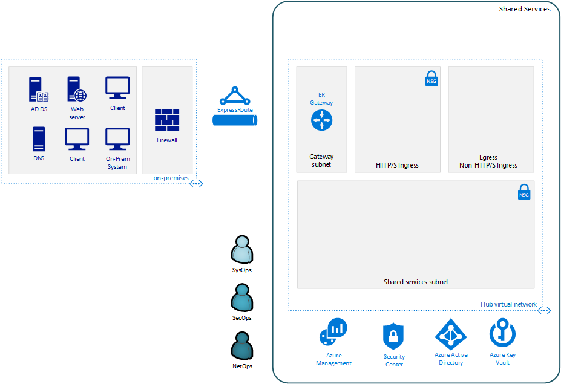
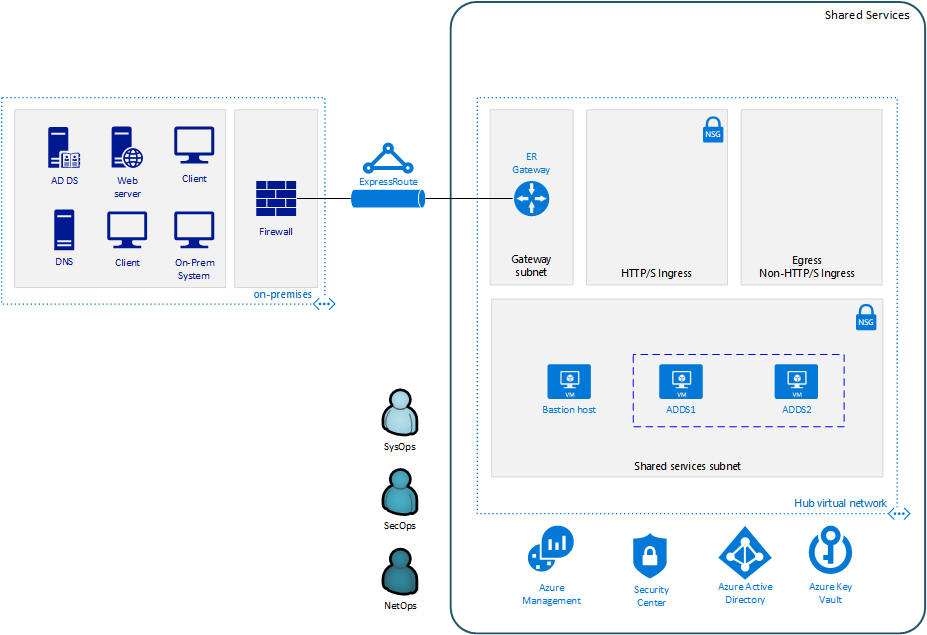

# Deploying the sample VDC shared services and central IT infrastructure

The following sections provide a step-by-step guide to deploying VDC
components using the sample deployments provided. Before starting this process,
you need to make sure you have completed the following:

-   Azure AD tenant configured

-   Azure subscription created

-   Subscription roles created

-   Parameters files updated with the correct settings for your target
    deployment

-   Required software installed (or Docker image created)

Also, before running any of the deployment steps make sure you have logged into
the Azure CLI as described in the [Launching the automation
script](05-launching-the-main-automation-script.md) section of this guide.

## Prerequisite: create and configure your parameters file

As discussed in the [parameter files](03-parameters-files.md#parameters-files) topic, the VDC Automation Toolkit provides a default test version of the top-level deployment parameter file. You will need to create a new version of this file before running your deployment. 

To do this, navigate to the toolkit's [archetypes/shared services](../archetypes/shared services) folder, then make a copy of the *archetype.test.json*, and name this copy *archetype.json*. Then proceed to edit archetype.json providing the subscription, organization, networking, and other configuration information that you want to use for your deployment. Make sure you use values for the on-premises parameters consistent with the on-premises environment your shared services will be connected with.

If your copy of the toolkit is associated with a git repository, the [.gitignore](../.gitignore) file provided by the default VDC Automation Toolkit is set to prevent this archetype.json file from being pushed to your code repository.

## Step 1: Deploy shared services operations and monitoring resources

**Required role: SysOps**

The first required resource deployment is "ops" module, which deploys the Operations
Management Suite (OMS) Instance and puts policy in place requiring virtual
machines deployed on the subscriptions to use Azure Monitor.

Start the "ops" deployment by running the following command in the terminal or
command-line interface:

[Linux/OSX]

>   *python3 vdc.py create shared-services -path "archetypes/shared-services/archetype.json" -m "la"*

[Windows]

>   *py vdc.py create shared-services -path "archetypes/shared-services/archetype.json" -m "la"*

[Docker]

>   *python vdc.py create shared-services -path "archetypes/shared-services/archetype.json" -m "la"*

This deployment creates the *{organization name}-{deployment name}-la-rg*
resource group that hosts the resources described in the following table.

| **Resource**                              | **Type**      | **Description**                              |
|-------------------------------------------|---------------|----------------------------------------------|
| {organization name}-{deployment name}-la | Log Analytics | Log Analytics instance for monitoring the shared services network. |

## Step 2: Deploy shared services Key Vault 

**Required role: SecOps**

The next step is deploying the "kv" module, which creates a Key Vault for the
shared services and generates the encryption keys that other resources will use in
subsequent deployment steps.

In addition to the Key Vault itself, this deployment also generates passwords for the local-admin-user and domain-admin-user names defined in the shared services parameters file and stores them as secrets in the vault. These passwords will be used throughout the deployment process when provisioning VMs in the shared services environment and accessing on-premises resources. To modify the default values for these passwords edit the [Key Vault deployment parameters file](../modules/shared-services-kv/1.0/azureDeploy.parameters.json) and update the secrets-object parameter.

Start the "kv" deployment by running the following command in the terminal or
command-line interface:

[Linux/OSX]

>   *python3 vdc.py create shared-services -path "archetypes/shared-services/archetype.json" -m "shared-services-kv"*

[Windows]

>   *py vdc.py create shared-services -path "archetypes/shared-services/archetype.json" -m "shared-services-kv"*

[Docker]

>   *python vdc.py create shared-services -path "archetypes/shared-services/archetype.json" -m "shared-services-kv"*

This deployment creates the *{organization name}-{deployment name}-kv-rg*
resource group that hosts the resources described in the following table.

| **Resource**                                           | **Type**        | **Description**                                                      |
|--------------------------------------------------------|-----------------|----------------------------------------------------------------------|
| {organization name}-{deployment name}-kv               | Key Vault       | Key Vault instance for the shared services. One certificate deployed by default. |
| {organization name}{deployment name}{random characters} | Storage account | Location of Key Vault audit logs.                                    |

## Step 3: Deploy shared services virtual network

**Required role: NetOps**

This step involves two resource deployments in the following order:

-   The "nsg" deployment module creates the network security groups (NSGs) and
    Azure security groups (ASGs) that secure the shared services virtual network.

-   The "net" deployment module creates the shared services virtual network, along with
    setting up the subnets and User Defined Routes (UDRs) used to route traffic
    coming from on-premises.

    The virtual network is divided into four subnets:

    -   Gateway, which hosts the virtual gateway that provides connectivity between
    the shared services and on-premises network.

    -   Shared services, which host the management jump boxes and servers providing
    Active Directory Domain Services (ADDS) and DNS for the VDC.

    -   Ingress, which will host the Application Gateway or any NVAs and related load balancers that control and secure
    traffic going to  the various spoke
    workspace networks.

    -   Egress, which will host the Azure Firewall instance that controls traffic coming from spoke networks.

**Note:** The ingress subnet will not be populated in the shared services deployment process. For the default sample deployment included in the toolkit, an Azure Application Gateway gets created in this subnet as part of the first spoke deployment. Subsequent spokes deployments will reuse this Application Gateway.

Start the "nsg" deployment by running the following command in the terminal or
command-line interface:

[Linux/OSX]

>   *python3 vdc.py create shared-services -path "archetypes/shared-services/archetype.json" -m "nsg"*

[Windows]

>   *py vdc.py create shared-services -path "archetypes/shared-services/archetype.json" -m "nsg"*

[Docker]

>   *py vdc.py create shared-services -path "archetypes/shared-services/archetype.json" -m "nsg"*

Then start the "net" deployment by running the following command in the terminal
or command-line interface:

[Linux/OSX]

>   *python3 vdc.py create shared-services -path "archetypes/shared-services/archetype.json" -m "shared-services-net"*

[Windows]

>   *py vdc.py create shared-services -path "archetypes/shared-services/archetype.json" -m "shared-services-net"*

[Docker]

>   *python vdc.py create shared-services -path "archetypes/shared-services/archetype.json" -m "shared-services-net"*

These deployments create the *{organization name}-{deployment name}-net-rg*
resource group that hosts the resources described in the following table.

| **Resource**                                             | **Type**               | **Description**                                                              |
|----------------------------------------------------------|------------------------|------------------------------------------------------------------------------|
| {deployment name}diag{random characters}                  | Storage account            | Storage account for diagnostic data related to the shared services virtual network.      |
| {organization name}-{deployment name}-dc-asg              | Application security group | Application security group applied to shared services ADDS servers.                      |
| {organization name}-{deployment name}-dmz-nsg             | Network security group     | Network security group attached to the DMZ subnet.                           |
| {organization name}-{deployment name}-jb-asg              | Application security group | Application security group applied to shared services management jump box VMs.                      |
| {organization name}-{deployment name}-sharedsvcs-nsg      | Network security group     | Network security group attached to the shared-services subnet.               |
| {organization name}-{deployment name}-sharedsvcs-udr      | Route table                | User defined routes for routing traffic to the shared-services subnet.       |
| {organization name}-{deployment name}-vnet-ddos-plan      | DDoS protection plan       | Standard Azure DDOS protection services (if enabled).                             |
| {organization name}-{deployment name}-vnet                | Virtual network            | The primary shared services virtual network, with the three following subnets:  &nbsp;&nbsp;&nbsp;&nbsp;-Gateway  &nbsp;&nbsp;&nbsp;&nbsp;-DMZ  &nbsp;&nbsp;&nbsp;&nbsp;-Shared-services           |

## Step 4: Establish connectivity between the on-premises network and the new virtual network 

**Required role: NetOps**

After deploying the shared services virtual network, you need to connect the VDC to your
on-premises network. How you do this depends on the connection type you use.

### ExpressRoute

If you're connecting your on-premises network to the VDC using ExpressRoute, you
need to manually [connect the shared services virtual network to your ExpressRoute
circuit](https://docs.microsoft.com/azure/expressroute/expressroute-howto-linkvnet-portal-resource-manager).

### VPN

If your connecting to the on-premises network through a VPN connection, you can
use the "vgw" deployment module to create an Azure virtual gateway in the shared services
network's gateway subnet.

Once the gateway is created, you need to configure the VPN connection between
the [gateway and your on-premises VPN
device](https://docs.microsoft.com/azure/vpn-gateway/vpn-gateway-howto-site-to-site-resource-manager-portal#VNetGateway).

Start the "vgw" deployment by running the following command in the terminal or
command-line interface:

[Linux/OSX]

>   *python3 vdc.py create shared-services -path "archetypes/shared-services/archetype.json" -m "vgw"*

[Windows]

>   *py vdc.py create shared-services -path "archetypes/shared-services/archetype.json" -m "vgw"*

[Docker]

>   *python vdc.py create shared-services -path "archetypes/shared-services/archetype.json" -m "vgw"*

These deployments create the resources to the *{organization name}-{deployment
name}-net-rg* resource group.

| **Resource**                                | **Type**                | **Description**                                              |
|---------------------------------------------|-------------------------|--------------------------------------------------------------|
| {organization name}-{deployment name}-gw     | Virtual network gateway | Gateway that allows connectivity to the on-premises network. |
| {organization name}-{deployment name}-gw-pip | Public IP address       | Publicly accessible IP address used by the gateway.          |

### Connecting to simulated on-premises

If you've deployed the Azure hosted simulated on-premises environment, you can
use the *vgw-connection* and *onprem-vgw-connection* deployment modules to finish connecting the shared services VPN
gateway created by the *vgw* deployment to the simulated on-premises network.

First you need to enable the connection on the VDC side. To do this, start the "vgw-connection" deployment by running the following command in the
terminal or command-line interface:

[Linux/OSX]

>   *python3 vdc.py create shared-services -path "archetypes/shared-services/archetype.json" -m "vgw-connection"*

[Windows]

>   *py vdc.py create shared-services -path "archetypes/shared-services/archetype.json" -m "vgw-connection"*

[Docker]

>   *python vdc.py create shared-services -path "archetypes/shared-services/archetype.json" -m "vgw-connection"*

Next, you'll enable the connection on the simulated on-premises side. To do this, start the "onprem-vgw-connection" deployment by running the following command in the
terminal or command-line interface:

[Linux/OSX]

>   *python3 vdc.py create shared-services -path "archetypes/shared-services/archetype.json" -m "onprem-vgw-connection"*

[Windows]

>   *py vdc.py create shared-services -path "archetypes/shared-services/archetype.json" -m "onprem-vgw-connection"*

[Docker]

>   *python vdc.py create shared-services -path "archetypes/shared-services/archetype.json" -m "onprem-vgw-connection"*

## Step 5: Deploy management jump boxes

**Required role: SysOps**

To manage VDC shared services resources, such as NVA devices from on-premises, you need
virtual machines serving as secure bastion hosts deployed in the shared services network
that you can use as jump boxes to remotely access these services.

The "jb" deployment module creates one Windows virtual machine and one Linux
virtual machine in the shared-services subnet that serve as secure management
jump boxes.

Start the "jb" deployment by running the following command in the terminal or
command-line interface:

[Linux/OSX]

>   *python3 vdc.py create shared-services -path "archetypes/shared-services/archetype.json" -m "jb" --upload-scripts*

[Windows]

>   *py vdc.py create shared-services -path "archetypes/shared-services/archetype.json" -m "jb" --upload-scripts*

[Docker]

>   *python vdc.py create shared-services -path "archetypes/shared-services/archetype.json" -m "jb" --upload-scripts*

Because the jump box virtual machines require post-deployment configuration
using custom scripts, use the "--upload-scripts" argument when running the
deployment to ensure the latest scripts are copied to the shared Azure Storage
location.

The jump box virtual machine will create a local admin user based on the local-admin-user value set in your top-level shared services parameters file, with a password stored in the shared services key vault.

This deployment creates the *{organization name}-{deployment name}-jb-rg*
resource group that hosts the resources described in the following table.

| **Resource**                                                               | **Type**          | **Description**                                                                         |
|----------------------------------------------------------------------------|-------------------|-----------------------------------------------------------------------------------------|
| {organization name}{deployment name}jb{random characters}                   | Storage account   | Storage account used to store diagnostic logs related to the jump box virtual machines. |
| {organization name}-{deployment name}-jb-linux-as                           | Availability set  | Availability set for Linux jump box virtual machines.                                   |
| {organization name}-{deployment name}-jb-linux-vm1                          | Virtual machine   | Linux virtual machine jump box.                                                         |
| {organization name}-{deployment name}-jb-linux-vm1-nic                      | Network interface | Virtual network interface for Linux virtual machine jump box.                           |
| {organization name}{deployment name}jblinuxvm1osdisk{random characters}     | Disk              | Virtual OS disk used by the Linux jump box virtual machine.                             |
| {organization name}-{deployment name}-jb-win-as                             | Availability set  | Availability set for Windows jump box virtual machines.                                 |
| {organization name}-{deployment name}-jb-win-vm1                            | Virtual machine   | Windows virtual machine jump box.                                                       |
| {organization name}-{deployment name}-jb-win-vm1-nic                        | Network interface | Virtual network interface for Windows virtual machine jump box.                         |
| {organization name}-{deployment name}jbwinvm1osdisk{random characters}      | Disk              | Virtual OS disk used by the Windows jump box virtual machine.                           |

## Step 6: Deploy ADDS servers 

**Required role: NetOps**

The shared services is meant to provide the rest of the VDC with DNS services and domain
integration with on-premises directory servers.

The "adds" deployment module creates a pair of Windows servers providing
Active Directory Domain Services (ADDS) integrated with an on-premises Active
Directory server and provides DNS services with the rest of the VDC.

The ADDS server virtual machines will create a local admin user based on the *local-admin-user* value set in your top-level shared services parameters file, with a password stored in the shared services key vault. In addition, it will use the *domain-admin-user* account from the parameter file to join these virtual machines to your on-premises domain.

As the ADDS servers require the installation of several Azure virtual machine
extensions, this deployment can take several hours to complete.

Note: In order for this deployment to complete successfully, you must have
successfully established connectivity with your on-premises network (Step 5) to
allow the newly deployed ADDS servers to communicate with your on-premises
domain servers. Also, make sure the on-premises related information in the shared services
deployment parameters file is accurate.

Start the "adds" deployment by running the following command in the terminal or
command-line interface:

[Linux/OSX]

>   *python3 vdc.py create shared-services -path "archetypes/shared-services/archetype.json" -m "adds" --upload-scripts*

[Windows]

>   *py vdc.py create shared-services -path "archetypes/shared-services/archetype.json" -m "adds" --upload-scripts*

[Docker]

>   *python vdc.py create shared-services -path "archetypes/shared-services/archetype.json" -m "adds" --upload-scripts*

Because the ADDS virtual machines require post-deployment configuration using
custom scripts, use the "--upload-scripts" argument when running the
deployment to ensure the latest scripts are copied to the shared Azure Storage
location.

This deployment creates the *{organization name}-{deployment name}-ad-rg*
resource group that hosts the resources described in the following table:

| **Resource**                                                                | **Type**          | **Description**                                                            |
|-----------------------------------------------------------------------------|-------------------|----------------------------------------------------------------------------|
| adds1osdsk{random characters}                                               | Disk              | Virtual OS disk for primary ADDS server.                                   |
| adds1dsk1{random characters}                                                | Disk              | Virtual data disk for primary ADDS server.                                 |
| adds2osdsk{random characters}                                               | Disk              | Virtual OS disk for secondary ADDS server.                                 |
| adds2dsk1{random characters}                                                | Disk              | Virtual data disk for secondary ADDS server.                               |
| {organization name}-{deployment name}-adds-as                                | Availability set  | Availability set for ADDS servers.                                         |
| {organization name}{deployment name}addsdiag{random characters}              | Storage account   | Storage account used to store diagnostic logs related to the ADDS servers. |
| {organization name}-{deployment name}-adds-vm1                               | Virtual machine   | Primary ADDS server.                                                       |
| {organization name}-{deployment name}-adds-vm1-nic                           | Network interface | Virtual network interface for primary ADDS server.                         |
| {organization name}-{deployment name}-adds-vm2                               | Virtual machine   | Secondary ADDS server.                                                     |
| {organization name}-{deployment name}-adds-vm2-nic                           | Network interface | Virtual network interface for secondary ADDS server.                       |

## Step 7: Deploy Azure Firewall

**Required role: SecOps**

In addition to NVAs that control and secure traffic between the on-premises and
VDC networks, the VDC Automation Toolkit uses Azure Firewall to provide
restricted access to the Internet from devices within your secure virtual
datacenter.

Note that Azure Firewall is currently in public preview. You need to [enable it
on your
subscription](https://docs.microsoft.com/azure/firewall/public-preview)
before deploying.

Start the "azure-fw" deployment by running the following command in the terminal
or command-line interface:

[Linux/OSX]

>   *python3 vdc.py create shared-services -path "archetypes/shared-services/archetype.json" -m "azure-fw"*

[Windows]

>   *py vdc.py create shared-services -path "archetypes/shared-services/archetype.json" -m "azure-fw"*

[Docker]

>   *python vdc.py create shared-services -path "archetypes/shared-services/archetype.json" -m "azure-fw"*

This deployment creates the following resources in the *{organization
name}-{deployment name}-net-rg resource group*.

| **Resource**                   | **Type**          | **Description**                                                       |
|--------------------------------|-------------------|-----------------------------------------------------------------------|
| {organization name}-{deployment name}-az-fw     | Firewall          | Azure Firewall instance used for any required access to the Internet. |
| {organization name}-{deployment name}-az-fw-pip | Public IP address | Public IP address used by the firewall.                               |
