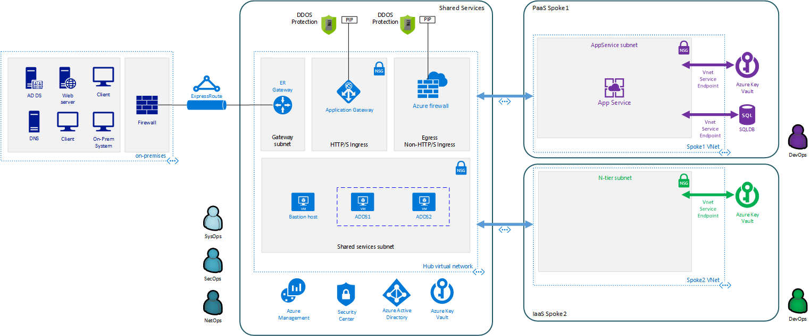
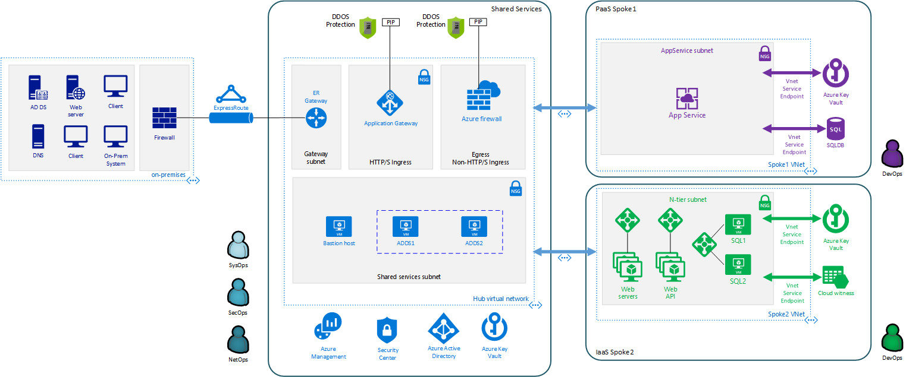

# Spoke example 2: IaaS N-tier architecture

In this second example, the toolkit provides example deployments for creating an
[N-tier application](https://docs.microsoft.com/azure/architecture/guide/architecture-styles/n-tier)
using virtual machines. This creates a single virtual machine running SQL
Server, and two load-balanced virtual machines for each of your application
tiers.

## Prerequisite: create and configure your parameters file

As discussed in the [parameter files](03-parameters-files.md#parameters-files) topic, the VDC Automation Toolkit provides a default test version of the top-level deployment parameter file. You will need to create a new version of this file before running your deployment. 

To do this, navigate to the toolkit's [archetypes/iaas](../archetypes/iaas) folder, then make a copy of the *archetype.test.json*, and name this copy *archetype.json*. Then proceed to edit archetype.json providing the subscription, organization, networking, and other configuration information that you want to use for your deployment. Make sure you use values for the hub and on-premises parameters consistent with those components of your VDC deployment.

If your copy of the toolkit is associated with a git repository, the [.gitignore](../.gitignore) file provided by the default VDC Automation Toolkit is set to prevent this archetype.json file from being pushed to your code repository.

## Deploy workload infrastructure

All workload environments require a common set of operations, key vault, and virtual network resources before they can connect to the hub network and host workloads. The following steps will  deploy these required resources. 

### Step 1: Deploy workload operations and monitoring resources

**Required role: SysOps**

This step provisions the operations and monitoring resources for the workload
environment.

Start the "ops" deployment by running the following command in the terminal or
command-line interface:

[Linux/OSX]

>   *python3 vdc.py create workload -path "archetypes/iaas/archetype.json" -m "la"*

[Windows]

>   *py vdc.py create workload -path "archetypes/iaas/archetype.json" -m "la"*

[Docker]

>   *python vdc.py create workload -path "archetypes/iaas/archetype.json" -m "la"*

This deployment creates the *{organization name}-{deployment name}-la-rg*
resource group that hosts the resources in the following table.

| **Resource**                             | **Type**      | **Description**                              |
|------------------------------------------|---------------|----------------------------------------------|
| {organization name}-{deployment name}-oms | Log Analytics | Log Analytics instance for monitoring the hub network. |

### Step 2: Deploy workload Key Vault

**Required role: SecOps**

This step deploys the workload "kv" resource, which deploys a Key Vault for the
workload environment and generates the encryption keys that are used for resources
deployed by the workspace DevOps teams.

In addition to the workload Key Vault, this deployment generates a password for the local-admin-user name defined in the workload parameters file, as well as a base64 certificate string and certificate password used for encrypting resources later in the deployment process. These values are stored as secrets in the vault. To modify the default values for these passwords edit the [Key Vault deployment parameters file](../modules/workload-kv/1.0/azureDeploy.parameters.json) and update the secrets-object parameter.

Start the "kv" deployment by running the following command in the terminal or
command-line interface:

[Linux/OSX]

>   *python3 vdc.py create workload -path "archetypes/iaas/archetype.json" -m "workload-kv"*

[Windows]

>   *py vdc.py create workload -path "archetypes/iaas/archetype.json" -m "workload-kv"*

[Docker]

>   *python vdc.py create workload -path "archetypes/iaas/archetype.json" -m "workload-kv"*

This deployment creates the *{organization name}-{deployment name}-kv-rg*
resource group that hosts the resources listed in the following table.

| **Resource**                                           | **Type**        | **Description**                                                        |
|--------------------------------------------------------|-----------------|------------------------------------------------------------------------|
| {organization name}-{deployment name}-kv               | Key Vault       | Key Vault instance for the workload. One certificate deployed by default. |
| {organization name}{deployment name (dashes removed)}kvdiag | Storage account | Location of Key Vault audit logs.                                      |

### Step 3: Deploy workload virtual network

**Required role: NetOps**

This step involves two resource deployments in the following order:

-   The "nsg" deployment module creates  the network security groups (NSGs) and
    Azure security groups (ASGs) that secure the workload virtual network. By
    default, the example workload net deployment creates a set of NSGs and ASGs
    compatible with an *n*-tier application, consisting of web, business, and
    data tiers.

-   The "net" deployment module creates  the workload virtual network, along with
    setting up the default subnet and User Defined Routes (UDRs) used to route
    traffic to the hub network. This deployment also creates the VNet peering
    that connects the hub and workload networks.

Start the "nsg" deployment by running the following command in the terminal or
command-line interface:

[Linux/OSX]

>   *python3 vdc.py create workload -path "archetypes/iaas/archetype.json" -m "nsg"*

[Windows]

>   *py vdc.py create workload -path "archetypes/iaas/archetype.json" -m "nsg"*

[Docker]

>   *python vdc.py create workload -path "archetypes/iaas/archetype.json" -m "nsg"*

Then start the "net" deployment by running the following command in the terminal
or command-line interface:

[Linux/OSX]

>   *python3 vdc.py create workload -path "archetypes/iaas/archetype.json" -m "workload-net"*

[Windows]

>   *py vdc.py create workload -path "archetypes/iaas/archetype.json" -m "workload-net"*

[Docker]

>   *python vdc.py create workload -path "archetypes/iaas/archetype.json" -m "workload-net"*

These deployments create the *{organization name}-{deployment name}-net-rg*
resource group that hosts the resources detailed in the following table.

| **Resource**                                                  | **Type**                     | **Description**                                                      |
|---------------------------------------------------------------|------------------------------|----------------------------------------------------------------------|
| {organization name}-{deployment name}-business-asg            | Application security group   | ASG for business-tier assets.                                        |
| {organization name}-{deployment name}-data-asg                | Application security group   | ASG for data-tier assets.                                            |
| {organization name}-{deployment name}-web-asg                 | Application security group   | ASG for web-tier assets.                                             |
| {organization name}-{deployment name}-vnet                    | Virtual network              | The primary workload virtual network, with a single default subnet.     |
| {organization name}-{deployment name}-{defaultsubnetname}-nsg | Network security group       | Network security group attached to the default subnet.               |
| {organization name}-{deployment name}-udr                     | Route table                  | User Defined Routes for routing traffic to and from the hub network. |
| {deployment name (dashes removed)}                 | Storage account              | Storage location for virtual network diagnostic data.                                |

## Deploy workload resources 

Once the workload operations, Key Vault, and virtual network resources are provisioned, your team can begin deploying actual workload resources. Performing the following tasks provisions the virtual machines and load balancers needed by DevOps to deploy an application with a data, business, and web tier.

### Deploy data tier

The "sqlserver-alwayson" deployment module creates a pair of load-balanced SQL
Server virtual machines used for the application's data layer.

A local user account will be created for these machines. The user name is defined in the local-admin-user parameter of the main deployment parameters file. The password for this user is generated and stored in the workload key vault as part of the "kv" deployment.

Start this deployment by running the following command in the terminal or
command-line interface:

[Linux/OSX]

>   *python3 vdc.py create workload -path "archetypes/iaas/archetype.json" -m "sqlserver-alwayson"*

[Windows]

>   *py vdc.py create workload -path "archetypes/iaas/archetype.json" -m "sqlserver-alwayson"*

[Docker]

>   *py vdc.py create workload -path "archetypes/iaas/archetype.json" -m "sqlserver-alwayson"*

This deployment creates the *{organization name}-{deployment
name}-sqlserver-alwayson-rg* resource group that hosts the following resources.

| **Resource**                                                                | **Type**          | **Description**                                                                                                                           |
|-----------------------------------------------------------------------------|-------------------|-------------------------------------------------------------------------------------------------------------------------------------------|
| sqlsvr1datadisk1{random characters}                                         | Disk              | First data disk for SQL Server virtual machine \#1.                                                                                       |
| sqlsvr1datadisk2{random characters}                                         | Disk              | Second data disk for SQL Server virtual machine \#1.                                                                                      |
| sqlsvr1osdisk{random characters}                                            | Disk              | OS disk for SQL Server virtual machine \#1.                                                                                               |
| sqlsvr2datadisk1{random characters}                                         | Disk              | First data disk for SQL Server virtual machine \#2.                                                                                       |
| sqlsvr2datadisk2{random characters}                                         | Disk              | Second data disk for SQL Server virtual machine \#2.                                                                                      |
| sqlsvr2osdisk{random characters}                                            | Disk              | OS disk for SQL Server virtual machine \#2.                                                                                               |
| sqlsvr-as                                                                   | Availability set  | Availability set for virtual machines.                                                                                                    |
| sqlsvrcw{random characters}                                                 | Storage account   | Windows Server [Cloud Witness](https://docs.microsoft.com/windows-server/failover-clustering/deploy-cloud-witness) storage account. |
| sqlsvrdiag{random characters}                                               | Storage account   | SQL Server virtual machine diagnostic storage account.                                                                                    |
| {organization name}-{deployment name}-sqlsvr-lb                             | Load balancer     | Load balancer for virtual machines.                                                                                                       |
| {organization name}-{deployment name}-sqlsvr-vm1                            | Virtual machine   | SQL Server virtual machine \#1.                                                                                                           |
| {organization name}-{deployment name}-sqlsvr-vm1-nic                        | Network interface | NIC for SQL Server virtual machine \#1.                                                                                                   |
| {organization name}-{deployment name}-sqlsvr-vm2                            | Virtual machine   | SQL Server virtual machine \#2.                                                                                                           |
| {organization name}-{deployment name}-sqlsvr-vm2-nic                        | Network interface | NIC for SQL Server virtual machine \#2.                                                                                                   |

### Deploy web tier 

The "vmapp-lb" deployment module creates the two virtual machines and a load
balancer used by the application's web-tier assets.

A local user account will be created for these machines. The user name is defined in the local-admin-user parameter of the main deployment parameters file. The password for this user is generated and stored in the workload key vault as part of the "kv" deployment.

Note that both the web tier and business tier use the vmapp-lb module to deploy their resources. To avoid needing to modify the parameter files for this module when deploying one or the other, the sample provides two module parameter files. These are defined in the workload parameter file's module dependencies section as *vmapp-web-lb* and *vmapp-biz-lb*, with the correct module parameter file location defined for each. In this step we will be calling *vmapp-web-lb*.

Start this deployment by running the following command in the terminal or command-line interface:

[Linux/OSX]

>   *python3 vdc.py create workload -path "archetypes/iaas/archetype.json" -m "*vmapp-web-lb*"*

[Windows]

>   *py vdc.py create workload -path "archetypes/iaas/archetype.json" -m "*vmapp-web-lb*"*

[Docker]

>   *python vdc.py create workload -path "archetypes/iaas/archetype.json" -m "*vmapp-web-lb*"*

This deployment creates the *{organization name}-{deployment name}-web-rg*
resource group that hosts the resources detailed in the following table.

| **Resource**                                                                                         | **Type**          | **Description**                                      |
|------------------------------------------------------------------------------------------------------|-------------------|------------------------------------------------------|
| {organization name}-{deployment name}-web-app-lb                                                     | Load balancer     | Load balancer for Web-tier virtual machines.         |
| {organization name}-{deployment name}-web-app-vm1                                                    | Virtual machine   | Web-tier virtual machine \#1.                        |
| {organization name}-{deployment name}-web-app-vm1-nic                                                | Network interface | NIC for virtual machine \#1.                         |
| {organization name}{deployment name (dashes removed)}webappvm1osdisk{random characters}              | Disk              | OS disk for virtual machine \#1.                     |
| {organization name}-{deployment name}-web-app-vm2                                                    | Virtual machine   | Web-tier virtual machine \#2.                        |
| {organization name}-{deployment name}-web-app-vm2-nic                                                | Network interface | NIC for virtual machine \#2.                         |
| {organization name}{deployment name (dashes removed)}webappvm2osdisk{random characters}              | Disk              | OS disk for virtual machine \#2.                     |
| web-app-as                                                                                           | Availability set  | Availability set for Web-tier virtual machines.      |
| webappdiag{random characters}                                                                        | Storage account   | Web-tier virtual machine diagnostic storage account. |

### Deploy Application Gateway to hub virtual network

**Required role: NetOps**

As part of this workload deployment, you will need to deploy an Azure Application Gateway to the hub network. This gateway will provide access to the web-tier load balancer from the public internet.

To deploy the application gateway, start the "app-gateway" deployment by running the following command in the terminal
or command-line interface:

[Linux/OSX]

>   *python3 vdc.py create workload -path "archetypes/iaas/archetype.json" -m "app-gateway"*

[Windows]

>   *py vdc.py create workload -path "archetypes/iaas/archetype.json" -m "app-gateway"*

[Docker]

>   *python vdc.py create workload -path "archetypes/iaas/archetype.json" -m "app-gateway"*

This deployment will deploy resource to the hub subscription's *{organization name}-{hub name}-net-rg*
resource group that hosts the resources detailed in the following table.

| **Resource**                                                              | **Type**          | **Description**                                           |
|---------------------------------------------------------------------------|-------------------|-----------------------------------------------------------|
| {organization name}-{deployment name}-app-gw     | Virtual network gateway | Application gateway  used to provide access to the Web tier from the internet. |
| {organization name}-{deployment name}-app-gw-pip | Public IP address       | Publicly accessible IP address used by the application gateway.          |

### Deploy business tier 

After deploying the application gateway, you will deploy two business tier VMs by modifying the workload parameters file and then using the same "vmapp-lb" deployment module you used to deploy the application's web tier.

To avoid needing to modify the parameter files for this module when deploying one or the other, the sample provides two module parameter files. These are defined in the workload parameter file's module dependencies section as *vmapp-web-lb* and *vmapp-biz-lb*, with the correct module parameter file location defined for each. In this step we will be calling *vmapp-biz-lb*.

A local user account will be created for these machines. The user name is defined in the local-admin-user parameter of the main deployment parameters file. The password for this user is generated and stored in the workload key vault as part of the "kv" deployment.

Start this deployment by running the following command in the terminal or command-line interface:

[Linux/OSX]

>   *python3 vdc.py workload -path "archetypes/iaas/archetype.json" -m "*vmapp-biz-lb*"*

[Windows]

>   *py vdc.py workload -path "archetypes/iaas/archetype.json" -m "*vmapp-biz-lb*"*

[Docker]

>   *python vdc.py workload -path "archetypes/iaas/archetype.json" -m "*vmapp-biz-lb*"*

This deployment creates the *{organization name}-{deployment name}-biz-rg*
resource group that hosts the resources listed in the following table.

| **Resource**                                                                                         | **Type**          | **Description**                                      |
|------------------------------------------------------------------------------------------------------|-------------------|------------------------------------------------------|
| {organization name}-{deployment name}-biz-app-lb                                                     | Load balancer     | Load balancer for business-tier virtual machines.         |
| {organization name}-{deployment name}-biz-app-vm1                                                    | Virtual machine   | Business-tier virtual machine \#1.                        |
| {organization name}-{deployment name}-biz-app-vm1-nic                                                | Network interface | NIC for virtual machine \#1.                         |
| {organization name}{deployment name (dashes removed)}bizappvm1osdisk{random characters}              | Disk              | OS disk for virtual machine \#1.                     |
| {organization name}-{deployment name}-biz-app-vm2                                                    | Virtual machine   | Business-tier virtual machine \#2.                        |
| {organization name}-{deployment name}-biz-app-vm2-nic                                                | Network interface | NIC for virtual machine \#2.                         |
| {organization name}{deployment name (dashes removed)}bizappvm2osdisk{random characters}              | Disk              | OS disk for virtual machine \#2.                     |
| biz-app-as                                                                                           | Availability set  | Availability set for biz-tier virtual machines.      |
| bizappdiag{random characters}                                                                        | Storage account   | Business-tier virtual machine diagnostic storage account. |